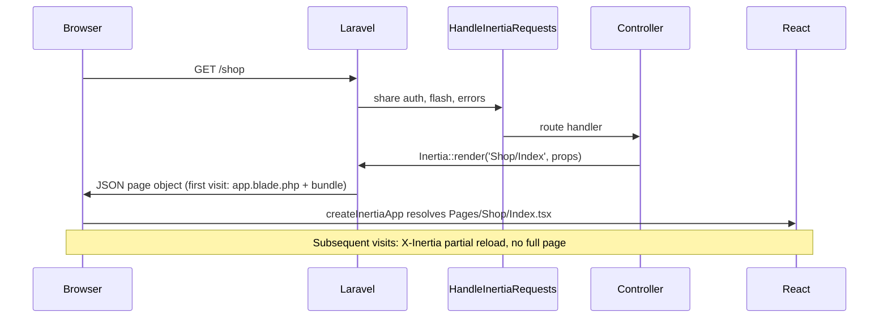
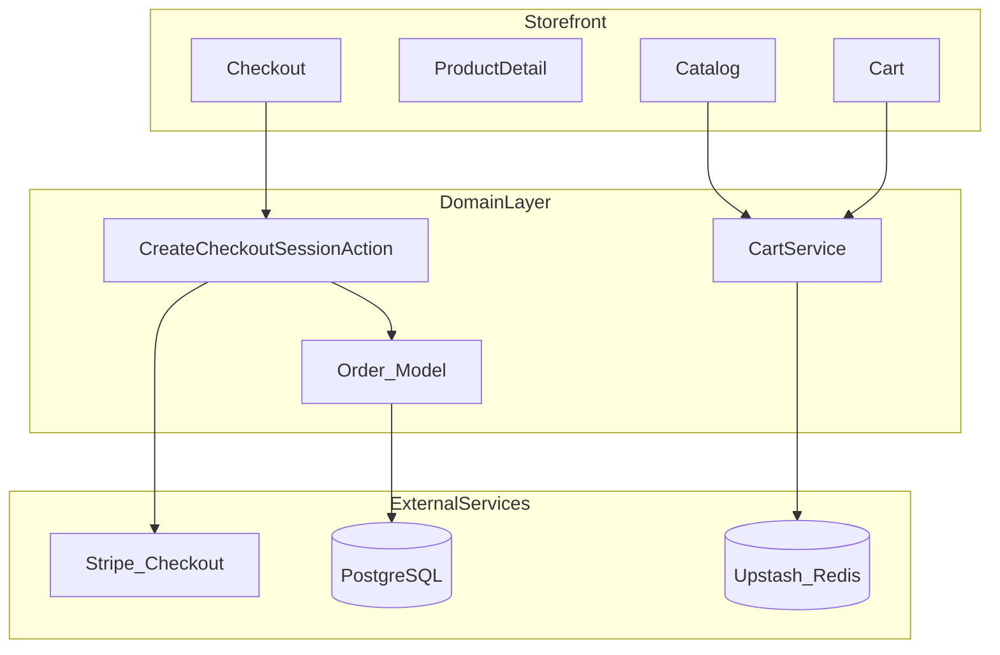
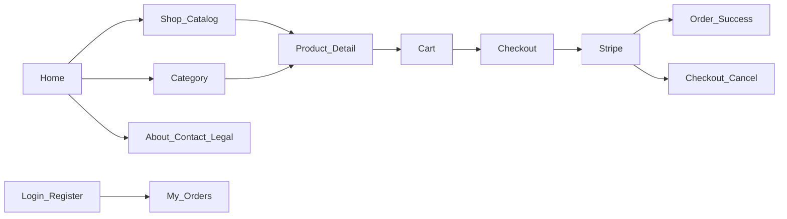

# Professional Architecture Checklist

E-commerce demo for **paradit-x.com** — Laravel 13, Inertia + React, Stripe, Vercel.

**Store type:** English-language online shoe store (sneakers, boots, casual, sport).

---

## Architecture Progress Checklist

Single source of truth for project completion. Legend: `[x]` done · `[~]` partial · `[ ]` not started.

**Overall:** ~35% complete (Phase 1 database layer done; shop UI not started)


| Phase                                                            | Progress | Status      |
| ---------------------------------------------------------------- | -------- | ----------- |
| **Phase 0** — Foundation (Laravel, Inertia, auth, Vercel config) | 18 / 20  | In progress |
| **Phase 1** — MVP demo (DB, shop UI, Stripe)                     | 7 / 14   | In progress |
| **Phase 2** — Polish (Redis, CDN, queue, tests)                  | 2 / 12   | Not started |
| **Phase 3** — Showcase (premium UI, CI/CD, domain)               | 0 / 6    | Not started |


---

### Phase 0 — Foundation

#### Stack & tooling

- Laravel 13 skeleton (`laravel/framework ^13`)
- PHP 8.3+
- Breeze + Inertia + React (`react --typescript`)
- `inertiajs/inertia-laravel` + `@inertiajs/react`
- Vite 7 + `@vitejs/plugin-react`
- TypeScript (`resources/js/app.tsx`)
- Tailwind CSS + `@tailwindcss/forms`
- Ziggy route helpers (`tightenco/ziggy`)
- `npm run build` → `public/build/` committed
- PHPStan + Larastan configured (`composer phpstan`)
- Laravel Pint configured (`composer pint`)
- Docker Compose (local PostgreSQL + Redis) — `docker-compose.yml`
- Pest (using PHPUnit for now)

#### Inertia & frontend base

- `HandleInertiaRequests` middleware registered
- `resources/views/app.blade.php` root template (`@inertia`, `@vite`)
- `createInertiaApp` + page resolution (`Pages/**/*.tsx`)
- Shared `auth.user` prop
- Shared `cartCount` prop (shop not built)
- `ShopLayout.tsx` storefront layout

#### Auth (Breeze)

- Login / Register / Logout
- Forgot password / Reset password
- Email verification flow (optional, not enforced on User model)
- Profile edit / password update / delete account
- `GuestLayout` + `AuthenticatedLayout`
- Auth feature tests (25 passing)

#### Deployment prep

- `vercel.json` (PHP serverless + static assets)
- `api/index.php` Vercel entry
- Trust proxies (`bootstrap/app.php`)
- Health check route `/up`
- `LOG_CHANNEL=stderr` in Vercel env
- `composer run vercel` deploy script
- [x] `.env.example` documented (PostgreSQL, Redis, Stripe placeholders)
- Production env vars set in Vercel Dashboard

---

### Phase 1 — MVP demo

#### Database & domain

- [~] PostgreSQL configured for production (Neon / Supabase) — `.env.example` + `DB_URL` documented
- [x] `categories` migration + model
- [x] `products` migration + model (price in cents)
- [x] `orders` + `order_items` migrations + models
- [x] Seeders (~20 demo shoes, 8 categories)
- [x] Factories for products/orders
- [x] `OrderStatus` / `PaymentStatus` enums
- `CartService` (session or Redis)
- Actions: `AddToCartAction`, `CreateCheckoutSessionAction`
- DTOs: `CheckoutData`, `CartItemData`

#### Storefront pages (MVP)

- Home (`/` → `Pages/Home.tsx`)
- Shop catalog (`/shop`)
- Category page (`/shop/{slug}`)
- Product detail (`/products/{slug}`) + size selector
- Cart (`/cart`)
- Checkout (`/checkout`)
- Order success / cancel pages

#### Stripe

- `stripe/stripe-php` installed
- Checkout Session (test mode)
- Webhook `checkout.session.completed`
- Webhook signature verification
- Stock decrease after payment only

---

### Phase 2 — Professional polish

- Upstash Redis (sessions, cache, cart on Vercel)
- Cloudinary / S3 + CDN for product images
- External queue worker (Railway / Fly.io)
- Order confirmation email (queued)
- Feature tests: cart, checkout, webhook
- Rate limiting on checkout + webhook
- Sentry / Flare error tracking
- Search, Sale, New arrivals pages
- About, Contact, Shipping & returns
- My orders + order detail pages
- 404 page
- Premium shop UI (indigo accent, Inter font)

---

### Phase 3 — Production showcase

- GitHub Actions (test → deploy Vercel)
- Custom domain `paradit-x.com` + SSL
- Privacy / Terms / Cookie policy pages
- Uptime monitoring (Better Stack / UptimeRobot)
- Stripe live mode + restricted API keys
- Vercel Cron or external scheduler

---

### Backend architecture (Laravel Way)

- [~] Thin controllers (auth only; shop controllers missing)
- [~] Form Requests (auth/profile only)
- [x] Enums for order/payment status
- DTOs for checkout/Stripe
- Actions for business operations
- Events + Listeners (order paid → email, stock)
- Policies (`OrderPolicy`, `ProductPolicy`)
- `declare(strict_types=1)` on all PHP files

---

### Security checklist

- CSRF protection (Laravel default)
- Trust proxies (Vercel / load balancers)
- [~] Input validation (auth forms only)
- Mass assignment protection (`User` fillable/hidden)
- Secrets in env, not git (`.env` gitignored)
- Rate limiting on public checkout/webhook routes
- Stripe webhook signature verification
- Security headers (`X-Frame-Options`, etc.)

---

### Quality & ops

- Auth + profile feature tests (PHPUnit)
- Health endpoint `/up`
- E-commerce feature tests
- Unit tests (CartService, pricing)
- CI/CD pipeline
- Error tracking in production
- Structured logging (order ID, session ID)

---

## Current Status (summary)


| Ready                                 | Missing                                |
| ------------------------------------- | -------------------------------------- |
| Laravel 13 + Breeze + Inertia + React | Shop / Cart / Checkout pages           |
| Auth UI + tests (25 passing)          | Stripe integration                     |
| Vercel config + `public/build`        | PostgreSQL in Vercel Dashboard (Neon)  |
| E-commerce domain (models, migrations, seeders) | Redis, CDN, queue worker       |
| Trust proxies, `/up` health check     | CI/CD, monitoring, custom domain       |
| Docker local dev (PG + Redis)         |                                        |


---

## 1. Infrastructure & Deployment


| #   | Component               | Recommendation                        | Why                            | Status                           |
| --- | ----------------------- | ------------------------------------- | ------------------------------ | -------------------------------- |
| 1.1 | **Hosting**             | Vercel (web) + external services      | Serverless, fast demo          | **Done**                         |
| 1.2 | **Database**            | PostgreSQL (Neon / Supabase)          | SQLite does not work on Vercel | **Configured** (`.env.example`)  |
| 1.3 | **Redis**               | Upstash Redis                         | Sessions, cache, cart          | **Required** (Docker local only) |
| 1.4 | **File storage**        | Cloudinary / S3 + CDN                 | No persistent disk on Vercel   | **Required**                     |
| 1.5 | **Queue workers**       | Railway / Fly.io / Upstash QStash     | Stripe webhook, emails         | **Required**                     |
| 1.6 | **Cron / scheduler**    | Vercel Cron Pro or external scheduler | Order cleanup, etc.            | Later                            |
| 1.7 | **Custom domain + SSL** | `paradit-x.com` → Vercel              | Professional demo              | **Required**                     |
| 1.8 | **Env management**      | Vercel Dashboard secrets              | Security                       | **Partial**                      |
| 1.9 | **Local dev stack**     | Docker Compose (PG + Redis)           | Match production locally       | **Done**                         |


---

## 2. Backend Architecture (Laravel Way)

```
app/
├── Actions/          ← One business operation = one class
├── Services/         ← CartService, PricingService
├── DTOs/             ← CheckoutData, CartItemData
├── Enums/            ← OrderStatus, PaymentStatus
├── Events/           ← OrderPaid, CartUpdated
├── Listeners/        ← SendOrderConfirmation
├── Http/
│   ├── Controllers/  ← Thin, coordination only
│   ├── Requests/     ← Validation
│   └── Resources/    ← API/response format
├── Models/           ← Eloquent + relationships
└── Policies/         ← Authorization
```


| #    | Principle              | Requirement                                      | Status                 |
| ---- | ---------------------- | ------------------------------------------------ | ---------------------- |
| 2.1  | **Thin controllers**   | Logic → Actions/Services                         | Partial (auth)         |
| 2.2  | **Form Requests**      | All POST/PUT with validation                     | Partial (auth/profile) |
| 2.3  | **Enums**              | Statuses, not strings (`OrderStatus::Paid`)      | **Done** (Order/Payment) |
| 2.4  | **DTOs**               | Stripe, checkout, API responses                  | Not started            |
| 2.5  | **Actions**            | `CreateCheckoutSessionAction`, `AddToCartAction` | Not started            |
| 2.6  | **Events + Listeners** | Order paid → email, stock update                 | Not started            |
| 2.7  | **Policies**           | `OrderPolicy`, `ProductPolicy`                   | Not started            |
| 2.8  | **Strict types**       | `declare(strict_types=1)` in all PHP files       | Not started            |
| 2.9  | **Service Container**  | Interface binding (`PaymentGatewayInterface`)    | Not started            |
| 2.10 | **Config, not .env**   | `config('services.stripe.key')`                  | Not started            |


---

## 3. Breeze + Inertia + React (installed)

> **Laravel 13 note:** The official [React Starter Kit](https://laravel.com/docs/13.x/starter-kits) (Inertia 3 + React 19 + Fortify + shadcn/ui) is the greenfield default. For an **existing skeleton**, we use **Laravel Breeze** with the `react` stack — same Inertia pattern, lighter auth scaffolding, full code ownership.

### 3.0 Stack overview


| Layer            | Package / tool                      | Version (project) |
| ---------------- | ----------------------------------- | ----------------- |
| Server adapter   | `inertiajs/inertia-laravel`         | ^2.0              |
| Client adapter   | `@inertiajs/react`                  | ^2.0              |
| Auth scaffolding | `laravel/breeze` (dev)              | ^2.4              |
| SPA framework    | React + TypeScript                  | ^18 + ^5          |
| Build            | Vite + `@vitejs/plugin-react`       | ^7                |
| Styling          | Tailwind CSS + `@tailwindcss/forms` | ^3                |
| Route helpers    | `tightenco/ziggy`                   | ^2.6              |


### 3.1 Installation (existing project)

Run from project root after Laravel skeleton is in place:

```bash
composer require laravel/breeze --dev
php artisan breeze:install react --typescript --no-interaction
npm install
npm run build
php artisan migrate
```

**Known fix:** Breeze ships `@types/node@^18`; Vite 7 requires `@types/node@^20.19.0`. Update `package.json` before `npm install` if you hit an `ERESOLVE` peer dependency error.

**Fresh project alternative** (Laravel 13 official):

```bash
laravel new my-app          # select React starter kit when prompted
# or
laravel new my-app --using=laravel/react-starter-kit
```

### 3.2 What Breeze generates

**Backend**


| File                                            | Purpose                                |
| ----------------------------------------------- | -------------------------------------- |
| `app/Http/Middleware/HandleInertiaRequests.php` | Shared Inertia props, root view        |
| `app/Http/Controllers/ProfileController.php`    | Profile CRUD                           |
| `app/Http/Controllers/Auth/`*                   | Login, register, password reset        |
| `routes/web.php`                                | Welcome, dashboard, profile            |
| `routes/auth.php`                               | Auth routes (guest / auth middleware)  |
| `resources/views/app.blade.php`                 | Root Blade shell (`@inertia`, `@vite`) |


**Frontend** (`resources/js/`)

```
resources/js/
├── app.tsx                    # createInertiaApp entry
├── bootstrap.ts               # Axios CSRF setup
├── Components/                # Breeze UI (Button, Input, Modal…)
├── Layouts/
│   ├── AuthenticatedLayout.tsx
│   └── GuestLayout.tsx
├── Pages/
│   ├── Welcome.tsx
│   ├── Dashboard.tsx
│   ├── Auth/                  # Login, Register, ForgotPassword…
│   └── Profile/               # Edit profile, password, delete account
└── types/                     # TypeScript globals (PageProps, User)
```

**Vite** — entry point switches from `app.js` to `app.tsx`:

```js
// vite.config.js
laravel({ input: 'resources/js/app.tsx', refresh: true }),
react(),
```

### 3.3 Inertia request flow




**Controller example** (from [Inertia docs](https://inertiajs.com/docs/v2/the-basics/pages)):

```php
use Inertia\Inertia;

return Inertia::render('Shop/Index', [
    'products' => $products,
]);
```

**Shared props** — extend `HandleInertiaRequests::share()` for shop data:

```php
public function share(Request $request): array
{
    return [
        ...parent::share($request),
        'auth' => ['user' => $request->user()],
        'cartCount' => fn () => app(CartService::class)->count(),
        'flash' => [
            'success' => fn () => $request->session()->get('success'),
        ],
    ];
}
```

**React access** — `usePage()` hook:

```tsx
import { usePage } from '@inertiajs/react';

const { auth, cartCount } = usePage().props;
```

**Forms** — `useForm` helper (Breeze auth pages use this):

```tsx
import { useForm } from '@inertiajs/react';

const { data, setData, post, processing, errors } = useForm({ email: '', password: '' });
post(route('login'));
```

### 3.4 Auth routes (Breeze)


| Route                     | Method           | Page component                          |
| ------------------------- | ---------------- | --------------------------------------- |
| `/login`                  | GET/POST         | `Pages/Auth/Login.tsx`                  |
| `/register`               | GET/POST         | `Pages/Auth/Register.tsx`               |
| `/forgot-password`        | GET/POST         | `Pages/Auth/ForgotPassword.tsx`         |
| `/reset-password/{token}` | GET/POST         | `Pages/Auth/ResetPassword.tsx`          |
| `/dashboard`              | GET              | `Pages/Dashboard.tsx` (auth + verified) |
| `/profile`                | GET/PATCH/DELETE | `Pages/Profile/Edit.tsx`                |


Verify with `php artisan route:list`.

### 3.5 Shop frontend (to build on top of Breeze)


| #     | Component          | Structure                                                | Status                |
| ----- | ------------------ | -------------------------------------------------------- | --------------------- |
| 3.5.1 | **Layout**         | `ShopLayout.tsx` — header, cart, footer                  | Not started           |
| 3.5.2 | **Pages**          | `Pages/Shop/`, `Pages/Cart/`, `Pages/Checkout/`          | Not started           |
| 3.5.3 | **Components**     | `ProductCard`, `SizeSelector`, `FilterSidebar`           | Not started           |
| 3.5.4 | **Hooks**          | `useCart`, `useFormatPrice`                              | Not started           |
| 3.5.5 | **Shared props**   | `cartCount`, `flash`, `auth` via `HandleInertiaRequests` | Partial (`auth` only) |
| 3.5.6 | **Type safety**    | TypeScript — extend `resources/js/types/index.d.ts`      | Done (base)           |
| 3.5.7 | **Asset strategy** | `npm run build` → commit `public/build` (Vercel)         | **Done**              |


**Layout strategy:** Keep Breeze `GuestLayout` / `AuthenticatedLayout` for auth; add `ShopLayout.tsx` for storefront pages. Account order pages can use `AuthenticatedLayout` or a slim `AccountLayout`.

### 3.6 Dev & deploy commands


| Command               | Purpose                                    |
| --------------------- | ------------------------------------------ |
| `composer run dev`    | PHP server + queue + logs + Vite HMR       |
| `npm run dev`         | Vite only                                  |
| `npm run build`       | `tsc && vite build` → `public/build/`      |
| `composer run vercel` | migrate + build + optimize (Vercel deploy) |


Optional SSR (not required for MVP): `php artisan breeze:install react --ssr` then `npm run build:ssr`.

---

## 4. Data Layer


| #   | Table          | Key fields                              | Indexes                      | Status                            |
| --- | -------------- | --------------------------------------- | ---------------------------- | --------------------------------- |
| 4.1 | `categories`   | name, slug                              | slug UNIQUE                  | **Done**                          |
| 4.2 | `products`     | price (cents), stock, slug, image_url   | slug, category_id, is_active | **Done**                        |
| 4.3 | `orders`       | status, email, stripe_session_id, total | stripe_session_id UNIQUE     | **Done**                          |
| 4.4 | `order_items`  | order_id, product_id, qty, unit_price   | order_id                     | **Done**                          |
| 4.5 | **Migrations** | FK, indexes, soft deletes (orders)      | —                            | **Done** (e-commerce tables)      |
| 4.6 | **Seeders**    | ~20 English demo products               | —                            | **Done** (21 products, 8 cats)    |
| 4.7 | **Factories**  | For tests                               | —                            | **Done**                          |


**Cart:** session (simple demo) or Redis (more professional, stateless on Vercel).

---

## 5. E-commerce Domain Flow




| #   | Feature      | Professional standard                       | Status      |
| --- | ------------ | ------------------------------------------- | ----------- |
| 5.1 | Catalog      | Filter, search, pagination                  | Not started |
| 5.2 | Product page | Stock check, quantity limits                | Not started |
| 5.3 | Cart         | Session/Redis, stock validation at checkout | Not started |
| 5.4 | Checkout     | Guest checkout + optional auth              | Not started |
| 5.5 | Orders       | Status enum, idempotency                    | Not started |
| 5.6 | Stock        | Decrease only after payment (webhook)       | Not started |
| 5.7 | Prices       | Integer cents (not float)                   | Not started |


---

## 6. Stripe Integration


| #   | Element               | Details                                                   | Status      |
| --- | --------------------- | --------------------------------------------------------- | ----------- |
| 6.1 | **Checkout Sessions** | One-time payments (not raw Payment Intents)               | Not started |
| 6.2 | **Webhook**           | `checkout.session.completed` → order = Paid               | Not started |
| 6.3 | **Webhook security**  | Stripe signature verification                             | Not started |
| 6.4 | **Idempotency**       | One session = one order                                   | Not started |
| 6.5 | **Metadata**          | `order_id` on Stripe session                              | Not started |
| 6.6 | **Test mode**         | Demo with `4242 4242 4242 4242`                           | Not started |
| 6.7 | **Webhook hosting**   | Vercel works, but queue on external worker is recommended | Not started |


**Professional approach:** process webhooks via **Queue Job** (Railway worker), not synchronously in the request.

---

## 7. Security


| #   | Requirement          | Implementation                              | Status           |
| --- | -------------------- | ------------------------------------------- | ---------------- |
| 7.1 | **HTTPS**            | Vercel automatic                            | Done (on deploy) |
| 7.2 | **CSRF**             | Laravel default (webhook exception)         | **Done**         |
| 7.3 | **Rate limiting**    | Checkout, webhook, API                      | Not started      |
| 7.4 | **Input validation** | Form Requests                               | Partial (auth)   |
| 7.5 | **Mass assignment**  | `$fillable` / DTO                           | **Done** (User)  |
| 7.6 | **Secrets**          | Vercel env only, never git                  | **Done**         |
| 7.7 | **Stripe keys**      | Restricted API key (RAK) in production      | Not started      |
| 7.8 | **Trust proxies**    | Configured in `bootstrap/app.php`           | **Done**         |
| 7.9 | **Headers**          | `X-Frame-Options`, `X-Content-Type-Options` | Not started      |


---

## 8. Performance (Vercel Serverless)


| #   | Optimization              | How                                   | Status                       |
| --- | ------------------------- | ------------------------------------- | ---------------------------- |
| 8.1 | **Eager loading**         | `Product::with('category')`           | Not started                  |
| 8.2 | **Cache**                 | Redis — categories, featured products | Not started                  |
| 8.3 | **Route/config cache**    | `artisan optimize` on deploy          | **Done** (`composer vercel`) |
| 8.4 | **Asset bundling**        | Vite production build                 | **Done**                     |
| 8.5 | **DB connection pooling** | Neon serverless driver                | Not started                  |
| 8.6 | **Images**                | CDN + WebP, not local on Vercel       | Not started                  |
| 8.7 | **Pagination**            | Not `Product::all()`                  | Not started                  |


---

## 9. Observability & Maintenance


| #   | Tool                  | Purpose                         | Status                 |
| --- | --------------------- | ------------------------------- | ---------------------- |
| 9.1 | **Logging**           | `LOG_CHANNEL=stderr` (Vercel)   | **Done** (vercel.json) |
| 9.2 | **Error tracking**    | Sentry / Flare                  | Not started            |
| 9.3 | **Uptime monitoring** | Better Stack / UptimeRobot      | Not started            |
| 9.4 | **Stripe Dashboard**  | Payment monitoring              | Not started            |
| 9.5 | **Health check**      | `/up` route                     | **Done**               |
| 9.6 | **Structured logs**   | Order ID, session ID in context | Not started            |


---

## 10. Testing & CI/CD


| #    | Test                | Coverage                           | Status                       |
| ---- | ------------------- | ---------------------------------- | ---------------------------- |
| 10.1 | **Feature tests**   | Cart, checkout, webhook            | Not started                  |
| 10.2 | **Unit tests**      | Pricing, CartService               | Not started                  |
| 10.3 | **Stripe mock**     | `Stripe::fake()` or HTTP mock      | Not started                  |
| 10.4 | **Pest.php**        | Modern syntax                      | Not started (PHPUnit)        |
| 10.5 | **GitHub Actions**  | Test → deploy to Vercel            | Not started                  |
| 10.6 | **Pre-deploy**      | `composer test` + `npm run build`  | Partial (auth tests + build) |
| 10.7 | **Auth tests**      | Login, register, password, profile | **Done** (25 tests)          |
| 10.8 | **Static analysis** | PHPStan / Larastan                 | **Done** (configured)        |
| 10.9 | **Code style**      | Laravel Pint                       | **Done** (configured)        |


---

## 11. Vercel-Specific Decisions


| Works on Vercel                | Does not work / limited              |
| ------------------------------ | ------------------------------------ |
| Web routes, Blade, Inertia     | Long queue jobs synchronously        |
| Stripe Checkout redirect       | `queue:work` without external worker |
| Webhook (short request)        | Local file storage                   |
| Static assets (`public/build`) | SQLite, file sessions at scale       |
| Stateless PHP functions        | Cron without Vercel Pro              |


### Recommended hybrid architecture

```
Vercel          → Web app (Laravel + Inertia)
Neon/Supabase   → PostgreSQL
Upstash         → Redis (sessions, cache)
Cloudinary      → Product images
Stripe          → Payments
Railway/Fly.io  → Queue worker (webhook, emails)
```

---

## 12. Implementation Priority

### Phase 0 — Foundation ✓ (mostly done)

1. ~~Laravel 13 skeleton~~ ✓
2. ~~Breeze + Inertia + React~~ ✓
3. ~~Vercel config + build pipeline~~ ✓
4. ~~Auth + tests~~ ✓
5. ~~Docker local dev (PG + Redis)~~ ✓

### Phase 1 — MVP demo (show clients)

1. ~~Breeze + Inertia + React~~ ✓
2. PostgreSQL (Neon) + migrations + seeders
3. Shop, Cart, Checkout UI
4. Stripe Checkout (test mode)
5. Webhook → order paid

### Phase 2 — Professional polish

1. Upstash Redis (sessions/cache)
2. Cloudinary images
3. Queue worker (Railway)
4. Feature tests
5. Sentry error tracking

### Phase 3 — Demo showcase

1. Premium UI (Linear/Vercel style)
2. GitHub Actions CI/CD
3. Custom domain `paradit-x.com`
4. Order confirmation email

---

## 13. Shoe Store — Pages & Routes

Complete page list for the apavu veikals demo. All customer-facing copy in **English**.

### Page map (user flow)




---

### Phase 1 — MVP (required for demo)


| #   | Page                   | Route                      | Inertia component            | Purpose                                        | Status                                |
| --- | ---------------------- | -------------------------- | ---------------------------- | ---------------------------------------------- | ------------------------------------- |
| 1   | **Home**               | `/`                        | `Pages/Home.tsx`             | Hero, featured shoes, categories, new arrivals | Not started (Welcome.tsx placeholder) |
| 2   | **Shop / Catalog**     | `/shop`                    | `Pages/Shop/Index.tsx`       | All products, filters, sort, pagination        | Not started                           |
| 3   | **Category**           | `/shop/{category:slug}`    | `Pages/Shop/Category.tsx`    | Men, Women, Kids, Sneakers, Boots, Sandals     | Not started                           |
| 4   | **Product detail**     | `/products/{product:slug}` | `Pages/Shop/Show.tsx`        | Images, price, **size selector**, add to cart  | Not started                           |
| 5   | **Cart**               | `/cart`                    | `Pages/Cart/Index.tsx`       | Line items, size/qty, subtotal, checkout CTA   | Not started                           |
| 6   | **Checkout**           | `/checkout`                | `Pages/Checkout/Index.tsx`   | Email, shipping address, order summary         | Not started                           |
| 7   | **Order success**      | `/checkout/success`        | `Pages/Checkout/Success.tsx` | Thank you, order number, summary               | Not started                           |
| 8   | **Checkout cancelled** | `/checkout/cancel`         | `Pages/Checkout/Cancel.tsx`  | Payment cancelled, return to cart              | Not started                           |


**Shoe-specific on Product detail:**

- Size picker (EU/US/UK — pick one system for MVP)
- Stock per size (disable sold-out sizes)
- Gallery (multiple angles)
- Brand, material, color
- “Size guide” link (modal or anchor)

---

### Phase 1 — Catalog filters (Shop page)


| Filter      | Example values                            |
| ----------- | ----------------------------------------- |
| Category    | Sneakers, Boots, Sandals, Running, Casual |
| Gender      | Men, Women, Unisex, Kids                  |
| Brand       | Nike, Adidas, New Balance, …              |
| Size        | 36–46 (only sizes in stock)               |
| Color       | Black, White, Brown, …                    |
| Price range | Min / max slider                          |
| Sort        | Newest, price low→high, price high→low    |


---

### Phase 2 — Trust & conversion


| #   | Page                   | Route               | Inertia component                  | Purpose                              |
| --- | ---------------------- | ------------------- | ---------------------------------- | ------------------------------------ |
| 9   | **Search results**     | `/search?q=`        | `Pages/Shop/Search.tsx`            | Full-text search by name, brand, SKU |
| 10  | **Sale**               | `/sale`             | `Pages/Shop/Sale.tsx`              | Discounted shoes                     |
| 11  | **New arrivals**       | `/new-arrivals`     | `Pages/Shop/NewArrivals.tsx`       | Latest products                      |
| 12  | **Size guide**         | `/size-guide`       | `Pages/SizeGuide.tsx`              | EU/US/UK conversion table            |
| 13  | **Shipping & returns** | `/shipping-returns` | `Pages/Static/ShippingReturns.tsx` | Delivery times, return policy        |
| 14  | **About**              | `/about`            | `Pages/Static/About.tsx`           | Brand story for demo                 |
| 15  | **Contact**            | `/contact`          | `Pages/Static/Contact.tsx`         | Form or email + FAQ snippet          |
| 16  | **404**                | fallback            | `Pages/Errors/NotFound.tsx`        | Friendly “page not found”            |


---

### Phase 2 — Auth & account (optional for MVP)


| #   | Page                | Route                     | Inertia component               | Purpose               | Status      |
| --- | ------------------- | ------------------------- | ------------------------------- | --------------------- | ----------- |
| 17  | **Login**           | `/login`                  | `Pages/Auth/Login.tsx`          | Existing customers    | **Done**    |
| 18  | **Register**        | `/register`               | `Pages/Auth/Register.tsx`       | Create account        | **Done**    |
| 19  | **Forgot password** | `/forgot-password`        | `Pages/Auth/ForgotPassword.tsx` | Password reset        | **Done**    |
| 20  | **My orders**       | `/account/orders`         | `Pages/Account/Orders.tsx`      | Order history (auth)  | Not started |
| 21  | **Order detail**    | `/account/orders/{order}` | `Pages/Account/OrderShow.tsx`   | Single order + status | Not started |


Guest checkout is enough for first demo; account pages can follow in Phase 2.

---

### Phase 3 — Legal (required before real production)


| #   | Page                 | Route      | Inertia component          |
| --- | -------------------- | ---------- | -------------------------- |
| 22  | **Privacy policy**   | `/privacy` | `Pages/Static/Privacy.tsx` |
| 23  | **Terms of service** | `/terms`   | `Pages/Static/Terms.tsx`   |
| 24  | **Cookie policy**    | `/cookies` | `Pages/Static/Cookies.tsx` |


Footer links to 22–24 on every page.

---

### Shared layout (not separate routes)


| Element              | Location         | Notes                                                         |
| -------------------- | ---------------- | ------------------------------------------------------------- |
| **Header**           | `ShopLayout.tsx` | Logo, nav (Shop, Men, Women, Sale), search, cart icon + count |
| **Footer**           | `ShopLayout.tsx` | Links, social, payment icons (Stripe), copyright              |
| **Mobile menu**      | Header           | Hamburger, categories                                         |
| **Cart drawer**      | Optional         | Slide-over instead of full cart page on mobile                |
| **Size guide modal** | Product page     | Quick access without leaving product                          |
| **Toast / flash**    | Global           | “Added to cart”, errors                                       |


---

### Suggested categories (seed data)


| Slug       | Name          | Use        |
| ---------- | ------------- | ---------- |
| `mens`     | Men's Shoes   | Main nav   |
| `womens`   | Women's Shoes | Main nav   |
| `kids`     | Kids' Shoes   | Main nav   |
| `sneakers` | Sneakers      | Collection |
| `boots`    | Boots         | Collection |
| `sandals`  | Sandals       | Seasonal   |
| `running`  | Running       | Sport      |
| `casual`   | Casual        | Everyday   |


---

### Page implementation checklist

#### Storefront (MVP)

- Home — hero, 3–4 featured products, category tiles
- Shop — grid, filters, pagination
- Category — filtered catalog per slug
- Product detail — size selector, gallery, add to cart
- Cart — update qty, remove, proceed to checkout
- Checkout — guest form + Stripe redirect
- Success / Cancel — post-payment states

#### Catalog & discovery (Phase 2)

- Search results page
- Sale / New arrivals collection pages
- Size guide (standalone + modal on product)
- 404 page

#### Trust & content (Phase 2)

- About
- Contact
- Shipping & returns

#### Account (Phase 2)

- Login / Register / Forgot password (Breeze)
- Profile edit / password / delete account (Breeze)
- My orders list
- Order detail

#### Legal (Phase 3)

- Privacy policy
- Terms of service
- Cookie policy

#### Layout & UX

- Breeze auth layouts (`GuestLayout`, `AuthenticatedLayout`)
- `ShopLayout` with header + footer
- Mobile-responsive shop navigation
- Cart count in header (shared Inertia prop)
- English copy throughout (shop)
- Premium UI (rounded cards, indigo accent, Inter font)

---

### File structure (React pages)

Breeze baseline (installed) + shop pages (to add):

```
resources/js/
├── app.tsx
├── bootstrap.ts
├── Components/              # Breeze UI + shop components
│   ├── ProductCard.tsx      # to add
│   ├── SizeSelector.tsx     # to add
│   └── …
├── Layouts/
│   ├── AuthenticatedLayout.tsx   # Breeze ✓
│   ├── GuestLayout.tsx           # Breeze ✓
│   └── ShopLayout.tsx            # to add
├── Pages/
│   ├── Welcome.tsx               # Breeze ✓ (replace with Home.tsx)
│   ├── Dashboard.tsx             # Breeze ✓
│   ├── Auth/                     # Breeze ✓ (Login, Register, …)
│   ├── Profile/                  # Breeze ✓
│   ├── Home.tsx                  # to add
│   ├── Shop/
│   │   ├── Index.tsx
│   │   ├── Category.tsx
│   │   ├── Show.tsx
│   │   ├── Search.tsx
│   │   ├── Sale.tsx
│   │   └── NewArrivals.tsx
│   ├── Cart/
│   │   └── Index.tsx
│   ├── Checkout/
│   │   ├── Index.tsx
│   │   ├── Success.tsx
│   │   └── Cancel.tsx
│   ├── Account/
│   │   ├── Orders.tsx
│   │   └── OrderShow.tsx
│   ├── Static/
│   │   ├── About.tsx
│   │   ├── Contact.tsx
│   │   ├── ShippingReturns.tsx
│   │   ├── Privacy.tsx
│   │   ├── Terms.tsx
│   │   └── Cookies.tsx
│   ├── SizeGuide.tsx
│   └── Errors/
│       └── NotFound.tsx
└── types/                   # Breeze ✓ — extend PageProps for shop
```

---

## Master Checklist

Quick verification before production. See **Architecture Progress Checklist** above for full detail.

### Backend

- [~] Controllers are thin; logic lives in Actions/Services (auth only)
- [~] Enums + DTOs + Form Requests (auth/profile only)
- `declare(strict_types=1)` on all PHP files
- Events/Listeners for order lifecycle
- Policies for authorization (shop)

### Infrastructure

- External DB (not SQLite in production)
- Redis for sessions/cache (not file driver) — Docker local ✓
- CDN for images (not `/storage` on Vercel)
- Queue worker for webhooks and emails
- Secrets only in env, never in git
- Custom domain + SSL configured

### E-commerce

- Prices stored as integer cents
- Stock updated only after Stripe webhook
- Cart validated against stock at checkout
- Order status managed via enum
- Stripe webhook signature verified

### Frontend

- Breeze + Inertia + React (auth, layouts, TypeScript)
- Shop layout + storefront pages
- Reusable shop UI components
- Production assets built and committed (`public/build`)
- Mobile-first, premium SaaS UI (shop)
- All MVP shoe store pages (see §13 checklist)

### Quality & ops

- Auth feature tests (25 passing)
- Feature tests for cart, checkout, webhook
- Rate limiting on public endpoints
- Error tracking (Sentry/Flare)
- CI/CD pipeline (GitHub Actions → Vercel)
- Health check endpoint (`/up`)

---

## Vercel Deploy Checklist

Before first production deploy:

- `APP_KEY` set in Vercel Dashboard
- `APP_URL=https://paradit-x.com`
- PostgreSQL credentials configured
- `VERCEL_FORCE_NO_BUILD_CACHE=1` (if deploy fails after composer update)
- Stripe test keys + webhook URL configured
- `public/build` committed to repository
- `vercel.json` + `api/index.php` configured
- `composer vercel` build script (migrate + build + optimize)

---

*Last updated: July 2026 — Architecture Progress Checklist added; Phase 0 ~90% complete*