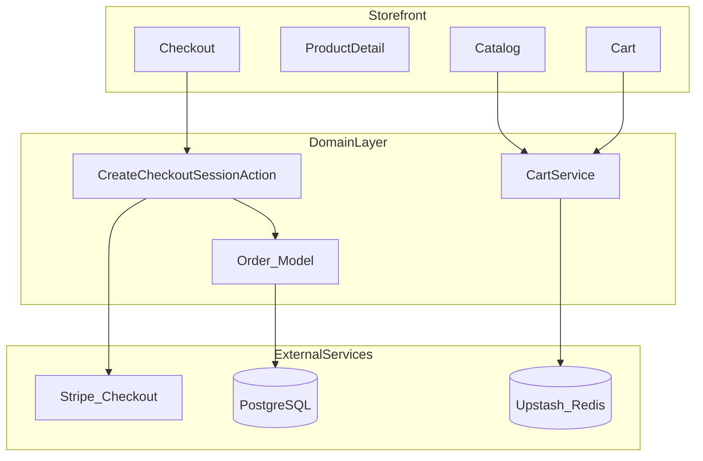
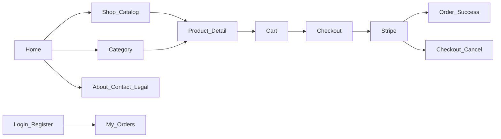

# Professional Architecture Checklist

E-commerce demo for **paradit-x.com** — Laravel 13, Inertia + React, Stripe, Vercel.

**Store type:** English-language online shoe store (sneakers, boots, casual, sport).

---

## Current Status

| Ready | Missing |
|-------|---------|
| Laravel 13 skeleton | Breeze + Inertia + React |
| Vercel configuration | E-commerce domain logic |
| `npm run build` for production | Stripe, DB, Redis |
| Trust proxies | Tests, CI/CD, monitoring |

---

## 1. Infrastructure & Deployment

| # | Component | Recommendation | Why | Status |
|---|-----------|--------------|-----|--------|
| 1.1 | **Hosting** | Vercel (web) + external services | Serverless, fast demo | Done |
| 1.2 | **Database** | PostgreSQL (Neon / Supabase) | SQLite does not work on Vercel | Required |
| 1.3 | **Redis** | Upstash Redis | Sessions, cache, cart (Inertia) | Required for Stripe/Livewire |
| 1.4 | **File storage** | Cloudinary / S3 + CDN | No persistent disk on Vercel | Required |
| 1.5 | **Queue workers** | Railway / Fly.io / Upstash QStash | Stripe webhook, emails | Required (Vercel cannot run workers) |
| 1.6 | **Cron / scheduler** | Vercel Cron Pro or external scheduler | Order cleanup, etc. | Later |
| 1.7 | **Custom domain + SSL** | `paradit-x.com` → Vercel | Professional demo | Required |
| 1.8 | **Env management** | Vercel Dashboard secrets | Security | Partial |

---

## 2. Backend Architecture (Laravel Way)

```
app/
├── Actions/          ← One business operation = one class
├── Services/         ← CartService, PricingService
├── DTOs/             ← CheckoutData, CartItemData
├── Enums/            ← OrderStatus, PaymentStatus
├── Events/           ← OrderPaid, CartUpdated
├── Listeners/        ← SendOrderConfirmation
├── Http/
│   ├── Controllers/  ← Thin, coordination only
│   ├── Requests/     ← Validation
│   └── Resources/    ← API/response format
├── Models/           ← Eloquent + relationships
└── Policies/         ← Authorization
```

| # | Principle | Requirement |
|---|-----------|-------------|
| 2.1 | **Thin controllers** | Logic → Actions/Services |
| 2.2 | **Form Requests** | All POST/PUT with validation |
| 2.3 | **Enums** | Statuses, not strings (`OrderStatus::Paid`) |
| 2.4 | **DTOs** | Stripe, checkout, API responses |
| 2.5 | **Actions** | `CreateCheckoutSessionAction`, `AddToCartAction` |
| 2.6 | **Events + Listeners** | Order paid → email, stock update |
| 2.7 | **Policies** | `OrderPolicy`, `ProductPolicy` |
| 2.8 | **Strict types** | `declare(strict_types=1)` in all PHP files |
| 2.9 | **Service Container** | Interface binding (`PaymentGatewayInterface`) |
| 2.10 | **Config, not .env** | `config('services.stripe.key')` |

---

## 3. Frontend Architecture (Inertia + React)

| # | Component | Structure |
|---|-----------|-----------|
| 3.1 | **Layout** | `ShopLayout.jsx` — header, cart, footer |
| 3.2 | **Pages** | `Pages/Shop/`, `Pages/Cart/`, `Pages/Checkout/` |
| 3.3 | **Components** | `ProductCard`, `Button`, `Input` — reusable |
| 3.4 | **Hooks** | `useCart`, `useFormatPrice` |
| 3.5 | **Shared props** | `cartCount`, `flash`, `auth` via `HandleInertiaRequests` |
| 3.6 | **Type safety** | TypeScript (recommended) or PropTypes |
| 3.7 | **Asset strategy** | `npm run build` → commit `public/build` (Vercel) |

---

## 4. Data Layer

| # | Table | Key fields | Indexes |
|---|-------|------------|---------|
| 4.1 | `categories` | name, slug | slug UNIQUE |
| 4.2 | `products` | price (cents), stock, slug, image_url | slug, category_id, is_active |
| 4.3 | `orders` | status, email, stripe_session_id, total | stripe_session_id UNIQUE |
| 4.4 | `order_items` | order_id, product_id, qty, unit_price | order_id |
| 4.5 | **Migrations** | FK, indexes, soft deletes (orders) | — |
| 4.6 | **Seeders** | ~20 English demo products | — |
| 4.7 | **Factories** | For tests | — |

**Cart:** session (simple demo) or Redis (more professional, stateless on Vercel).

---

## 5. E-commerce Domain Flow



| # | Feature | Professional standard |
|---|---------|----------------------|
| 5.1 | Catalog | Filter, search, pagination |
| 5.2 | Product page | Stock check, quantity limits |
| 5.3 | Cart | Session/Redis, stock validation at checkout |
| 5.4 | Checkout | Guest checkout + optional auth |
| 5.5 | Orders | Status enum, idempotency |
| 5.6 | Stock | Decrease only after payment (webhook) |
| 5.7 | Prices | Integer cents (not float) |

---

## 6. Stripe Integration

| # | Element | Details |
|---|---------|---------|
| 6.1 | **Checkout Sessions** | One-time payments (not raw Payment Intents) |
| 6.2 | **Webhook** | `checkout.session.completed` → order = Paid |
| 6.3 | **Webhook security** | Stripe signature verification |
| 6.4 | **Idempotency** | One session = one order |
| 6.5 | **Metadata** | `order_id` on Stripe session |
| 6.6 | **Test mode** | Demo with `4242 4242 4242 4242` |
| 6.7 | **Webhook hosting** | Vercel works, but queue on external worker is recommended |

**Professional approach:** process webhooks via **Queue Job** (Railway worker), not synchronously in the request.

---

## 7. Security

| # | Requirement | Implementation |
|---|-------------|----------------|
| 7.1 | **HTTPS** | Vercel automatic |
| 7.2 | **CSRF** | Laravel default (webhook exception) |
| 7.3 | **Rate limiting** | Checkout, webhook, API |
| 7.4 | **Input validation** | Form Requests |
| 7.5 | **Mass assignment** | `$fillable` / DTO |
| 7.6 | **Secrets** | Vercel env only, never git |
| 7.7 | **Stripe keys** | Restricted API key (RAK) in production |
| 7.8 | **Trust proxies** | Configured in `bootstrap/app.php` |
| 7.9 | **Headers** | `X-Frame-Options`, `X-Content-Type-Options` |

---

## 8. Performance (Vercel Serverless)

| # | Optimization | How |
|---|--------------|-----|
| 8.1 | **Eager loading** | `Product::with('category')` |
| 8.2 | **Cache** | Redis — categories, featured products |
| 8.3 | **Route/config cache** | `artisan optimize` on deploy |
| 8.4 | **Asset bundling** | Vite production build |
| 8.5 | **DB connection pooling** | Neon serverless driver |
| 8.6 | **Images** | CDN + WebP, not local on Vercel |
| 8.7 | **Pagination** | Not `Product::all()` |

---

## 9. Observability & Maintenance

| # | Tool | Purpose |
|---|------|---------|
| 9.1 | **Logging** | `LOG_CHANNEL=stderr` (Vercel) |
| 9.2 | **Error tracking** | Sentry / Flare |
| 9.3 | **Uptime monitoring** | Better Stack / UptimeRobot |
| 9.4 | **Stripe Dashboard** | Payment monitoring |
| 9.5 | **Health check** | `/up` route |
| 9.6 | **Structured logs** | Order ID, session ID in context |

---

## 10. Testing & CI/CD

| # | Test | Coverage |
|---|------|----------|
| 10.1 | **Feature tests** | Cart, checkout, webhook |
| 10.2 | **Unit tests** | Pricing, CartService |
| 10.3 | **Stripe mock** | `Stripe::fake()` or HTTP mock |
| 10.4 | **Pest.php** | Modern syntax |
| 10.5 | **GitHub Actions** | Test → deploy to Vercel |
| 10.6 | **Pre-deploy** | `composer test` + `npm run build` |

---

## 11. Vercel-Specific Decisions

| Works on Vercel | Does not work / limited |
|-----------------|-------------------------|
| Web routes, Blade, Inertia | Long queue jobs synchronously |
| Stripe Checkout redirect | `queue:work` without external worker |
| Webhook (short request) | Local file storage |
| Static assets (`public/build`) | SQLite, file sessions at scale |
| Stateless PHP functions | Cron without Vercel Pro |

### Recommended hybrid architecture

```
Vercel          → Web app (Laravel + Inertia)
Neon/Supabase   → PostgreSQL
Upstash         → Redis (sessions, cache)
Cloudinary      → Product images
Stripe          → Payments
Railway/Fly.io  → Queue worker (webhook, emails)
```

---

## 12. Implementation Priority

### Phase 1 — MVP demo (show clients)

1. Breeze + Inertia + React
2. PostgreSQL (Neon) + migrations + seeders
3. Shop, Cart, Checkout UI
4. Stripe Checkout (test mode)
5. Webhook → order paid

### Phase 2 — Professional polish

6. Upstash Redis (sessions/cache)
7. Cloudinary images
8. Queue worker (Railway)
9. Feature tests
10. Sentry error tracking

### Phase 3 — Demo showcase

11. Premium UI (Linear/Vercel style)
12. GitHub Actions CI/CD
13. Custom domain `paradit-x.com`
14. Order confirmation email

---

## 13. Shoe Store — Pages & Routes

Complete page list for the apavu veikals demo. All customer-facing copy in **English**.

### Page map (user flow)



---

### Phase 1 — MVP (required for demo)

| # | Page | Route | Inertia component | Purpose |
|---|------|-------|-------------------|---------|
| 1 | **Home** | `/` | `Pages/Home.jsx` | Hero, featured shoes, categories, new arrivals |
| 2 | **Shop / Catalog** | `/shop` | `Pages/Shop/Index.jsx` | All products, filters, sort, pagination |
| 3 | **Category** | `/shop/{category:slug}` | `Pages/Shop/Category.jsx` | Men, Women, Kids, Sneakers, Boots, Sandals |
| 4 | **Product detail** | `/products/{product:slug}` | `Pages/Shop/Show.jsx` | Images, price, **size selector**, add to cart |
| 5 | **Cart** | `/cart` | `Pages/Cart/Index.jsx` | Line items, size/qty, subtotal, checkout CTA |
| 6 | **Checkout** | `/checkout` | `Pages/Checkout/Index.jsx` | Email, shipping address, order summary |
| 7 | **Order success** | `/checkout/success` | `Pages/Checkout/Success.jsx` | Thank you, order number, summary |
| 8 | **Checkout cancelled** | `/checkout/cancel` | `Pages/Checkout/Cancel.jsx` | Payment cancelled, return to cart |

**Shoe-specific on Product detail:**
- Size picker (EU/US/UK — pick one system for MVP)
- Stock per size (disable sold-out sizes)
- Gallery (multiple angles)
- Brand, material, color
- “Size guide” link (modal or anchor)

---

### Phase 1 — Catalog filters (Shop page)

| Filter | Example values |
|--------|----------------|
| Category | Sneakers, Boots, Sandals, Running, Casual |
| Gender | Men, Women, Unisex, Kids |
| Brand | Nike, Adidas, New Balance, … |
| Size | 36–46 (only sizes in stock) |
| Color | Black, White, Brown, … |
| Price range | Min / max slider |
| Sort | Newest, price low→high, price high→low |

---

### Phase 2 — Trust & conversion

| # | Page | Route | Inertia component | Purpose |
|---|------|-------|-------------------|---------|
| 9 | **Search results** | `/search?q=` | `Pages/Shop/Search.jsx` | Full-text search by name, brand, SKU |
| 10 | **Sale** | `/sale` | `Pages/Shop/Sale.jsx` | Discounted shoes |
| 11 | **New arrivals** | `/new-arrivals` | `Pages/Shop/NewArrivals.jsx` | Latest products |
| 12 | **Size guide** | `/size-guide` | `Pages/SizeGuide.jsx` | EU/US/UK conversion table |
| 13 | **Shipping & returns** | `/shipping-returns` | `Pages/Static/ShippingReturns.jsx` | Delivery times, return policy |
| 14 | **About** | `/about` | `Pages/Static/About.jsx` | Brand story for demo |
| 15 | **Contact** | `/contact` | `Pages/Static/Contact.jsx` | Form or email + FAQ snippet |
| 16 | **404** | fallback | `Pages/Errors/NotFound.jsx` | Friendly “page not found” |

---

### Phase 2 — Auth & account (optional for MVP)

| # | Page | Route | Inertia component | Purpose |
|---|------|-------|-------------------|---------|
| 17 | **Login** | `/login` | Breeze `Pages/Auth/Login.jsx` | Existing customers |
| 18 | **Register** | `/register` | Breeze `Pages/Auth/Register.jsx` | Create account |
| 19 | **Forgot password** | `/forgot-password` | Breeze | Password reset |
| 20 | **My orders** | `/account/orders` | `Pages/Account/Orders.jsx` | Order history (auth) |
| 21 | **Order detail** | `/account/orders/{order}` | `Pages/Account/OrderShow.jsx` | Single order + status |

Guest checkout is enough for first demo; account pages can follow in Phase 2.

---

### Phase 3 — Legal (required before real production)

| # | Page | Route | Inertia component |
|---|------|-------|-------------------|
| 22 | **Privacy policy** | `/privacy` | `Pages/Static/Privacy.jsx` |
| 23 | **Terms of service** | `/terms` | `Pages/Static/Terms.jsx` |
| 24 | **Cookie policy** | `/cookies` | `Pages/Static/Cookies.jsx` |

Footer links to 22–24 on every page.

---

### Shared layout (not separate routes)

| Element | Location | Notes |
|---------|----------|--------|
| **Header** | `ShopLayout.jsx` | Logo, nav (Shop, Men, Women, Sale), search, cart icon + count |
| **Footer** | `ShopLayout.jsx` | Links, social, payment icons (Stripe), copyright |
| **Mobile menu** | Header | Hamburger, categories |
| **Cart drawer** | Optional | Slide-over instead of full cart page on mobile |
| **Size guide modal** | Product page | Quick access without leaving product |
| **Toast / flash** | Global | “Added to cart”, errors |

---

### Suggested categories (seed data)

| Slug | Name | Use |
|------|------|-----|
| `mens` | Men's Shoes | Main nav |
| `womens` | Women's Shoes | Main nav |
| `kids` | Kids' Shoes | Main nav |
| `sneakers` | Sneakers | Collection |
| `boots` | Boots | Collection |
| `sandals` | Sandals | Seasonal |
| `running` | Running | Sport |
| `casual` | Casual | Everyday |

---

### Page implementation checklist

#### Storefront (MVP)

- [ ] Home — hero, 3–4 featured products, category tiles
- [ ] Shop — grid, filters, pagination
- [ ] Category — filtered catalog per slug
- [ ] Product detail — size selector, gallery, add to cart
- [ ] Cart — update qty, remove, proceed to checkout
- [ ] Checkout — guest form + Stripe redirect
- [ ] Success / Cancel — post-payment states

#### Catalog & discovery (Phase 2)

- [ ] Search results page
- [ ] Sale / New arrivals collection pages
- [ ] Size guide (standalone + modal on product)
- [ ] 404 page

#### Trust & content (Phase 2)

- [ ] About
- [ ] Contact
- [ ] Shipping & returns

#### Account (Phase 2)

- [ ] Login / Register (Breeze)
- [ ] My orders list
- [ ] Order detail

#### Legal (Phase 3)

- [ ] Privacy policy
- [ ] Terms of service
- [ ] Cookie policy

#### Layout & UX

- [ ] `ShopLayout` with header + footer
- [ ] Mobile-responsive navigation
- [ ] Cart count in header (shared Inertia prop)
- [ ] English copy throughout
- [ ] Premium UI (rounded cards, indigo accent, Inter font)

---

### File structure (React pages)

```
resources/js/
├── Layouts/
│   └── ShopLayout.jsx
├── Pages/
│   ├── Home.jsx
│   ├── Shop/
│   │   ├── Index.jsx
│   │   ├── Category.jsx
│   │   ├── Show.jsx
│   │   ├── Search.jsx
│   │   ├── Sale.jsx
│   │   └── NewArrivals.jsx
│   ├── Cart/
│   │   └── Index.jsx
│   ├── Checkout/
│   │   ├── Index.jsx
│   │   ├── Success.jsx
│   │   └── Cancel.jsx
│   ├── Account/
│   │   ├── Orders.jsx
│   │   └── OrderShow.jsx
│   ├── Static/
│   │   ├── About.jsx
│   │   ├── Contact.jsx
│   │   ├── ShippingReturns.jsx
│   │   ├── Privacy.jsx
│   │   ├── Terms.jsx
│   │   └── Cookies.jsx
│   ├── SizeGuide.jsx
│   └── Errors/
│       └── NotFound.jsx
└── Components/
    ├── ProductCard.jsx
    ├── SizeSelector.jsx
    ├── CartItem.jsx
    ├── FilterSidebar.jsx
    └── Button.jsx
```

---

## Master Checklist

Use this to verify the architecture is production-ready.

### Backend

- [ ] Controllers are thin; logic lives in Actions/Services
- [ ] Enums + DTOs + Form Requests in place
- [ ] `declare(strict_types=1)` on all PHP files
- [ ] Events/Listeners for order lifecycle
- [ ] Policies for authorization

### Infrastructure

- [ ] External DB (not SQLite in production)
- [ ] Redis for sessions/cache (not file driver)
- [ ] CDN for images (not `/storage` on Vercel)
- [ ] Queue worker for webhooks and emails
- [ ] Secrets only in env, never in git
- [ ] Custom domain + SSL configured

### E-commerce

- [ ] Prices stored as integer cents
- [ ] Stock updated only after Stripe webhook
- [ ] Cart validated against stock at checkout
- [ ] Order status managed via enum
- [ ] Stripe webhook signature verified

### Frontend

- [ ] Inertia + React with shared layout
- [ ] Reusable UI components
- [ ] Production assets built and committed (`public/build`)
- [ ] Mobile-first, premium SaaS UI
- [ ] All MVP shoe store pages (see §13 checklist)

### Quality & ops

- [ ] Feature tests for cart, checkout, webhook
- [ ] Rate limiting on public endpoints
- [ ] Error tracking (Sentry/Flare)
- [ ] CI/CD pipeline (GitHub Actions → Vercel)
- [ ] Health check endpoint monitored

---

## Vercel Deploy Checklist

Before first production deploy:

- [ ] `APP_KEY` set in Vercel Dashboard
- [ ] `APP_URL=https://paradit-x.com`
- [ ] PostgreSQL credentials configured
- [ ] `VERCEL_FORCE_NO_BUILD_CACHE=1` (if deploy fails after composer update)
- [ ] Stripe test keys + webhook URL configured
- [ ] `public/build` committed to repository

---

*Last updated: July 2026*
