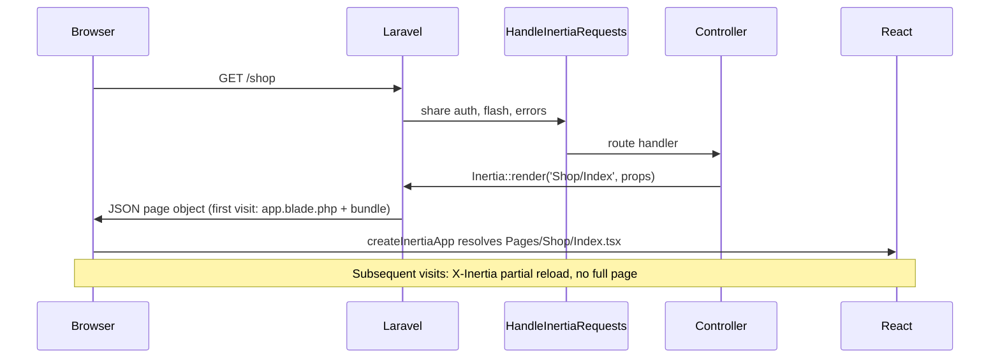
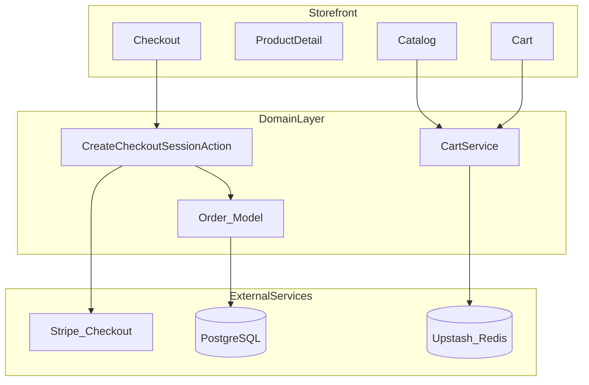
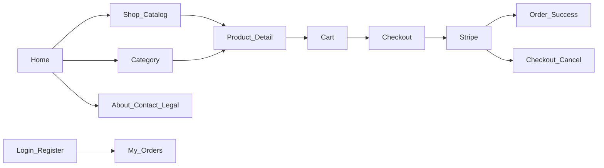

# Professional Architecture Checklist

E-commerce demo for **paradit-x.com** — Laravel 13, Inertia + React, Stripe, Vercel.

**Store type:** English-language online shoe store (sneakers, boots, casual, sport).

---

## Architecture Progress Checklist

Single source of truth for project completion. Legend: `[x]` done · `[~]` partial · `[ ]` not started.

**Overall:** ~83% complete (Phase 0 done; Phase 1 MVP done; Phase 2 in progress — account orders + premium auth UI done)


| Phase                                                            | Progress | Status      |
| ---------------------------------------------------------------- | -------- | ----------- |
| **Phase 0** — Foundation (Laravel, Inertia, auth, Vercel config) | 22 / 22  | **Done**    |
| **Phase 1** — MVP demo (DB, shop UI, Stripe)                     | 14 / 14  | **Done**    |
| **Phase 2** — Polish (Redis, CDN, queue, tests)                  | 9 / 12   | In progress |
| **Phase 3** — Showcase (premium UI, CI/CD, domain)               | 0 / 6    | Not started |


---

### Phase 0 — Foundation

#### Stack & tooling

- [x] Laravel 13 skeleton (`laravel/framework ^13`)
- [x] PHP 8.3+
- [x] Breeze + Inertia + React (`react --typescript`)
- [x] `inertiajs/inertia-laravel` + `@inertiajs/react`
- [x] Vite 7 + `@vitejs/plugin-react`
- [x] TypeScript (`resources/js/app.tsx`)
- [x] Tailwind CSS + `@tailwindcss/forms`
- [x] Ziggy route helpers (`tightenco/ziggy`)
- [x] `npm run build` → `public/build/` committed (required for Vercel `@vercel/static`)
- [x] Vite `build.emptyOutDir: true` (`vite.config.js` — clean local rebuilds)
- [x] PHPStan + Larastan configured (`composer phpstan`)
- [x] Laravel Pint configured (`composer pint`)
- [x] Docker Compose (local PostgreSQL + Redis) — `docker-compose.yml`
- [ ] Pest (using PHPUnit for now)

#### Inertia & frontend base

- [x] `HandleInertiaRequests` middleware registered
- [x] `resources/views/app.blade.php` root template (`@inertia`, `@vite`)
- [x] `createInertiaApp` + page resolution (`Pages/**/*.tsx`)
- [x] Shared `auth.user` prop
- [x] Shared `cartCount` prop (shop)
- [x] `ShopLayout.tsx` storefront layout

#### Auth (Breeze)

- [x] Login / Register / Logout
- [x] Forgot password / Reset password
- [x] Email verification flow (optional, not enforced on User model)
- [x] Profile edit / password update / delete account
- [x] `GuestLayout` + `AuthenticatedLayout`
- [x] Premium auth UI (`AuthLayout`, `AuthField`, `AuthButton` — Login + Register match shop design)
- [x] Post-auth redirect to storefront (`CustomerRedirect` → home; `/dashboard` reserved for future admin)
- [x] Auth feature tests (26 passing; redirects updated for customer flow)

#### Deployment prep

- [x] `vercel.json` (PHP serverless + static assets)
- [x] `api/index.php` Vercel entry
- [x] Trust proxies (`bootstrap/app.php`)
- [x] Health check route `/up`
- [x] `LOG_CHANNEL=stderr` in Vercel env
- [x] `composer run vercel` deploy script (migrate + optimize only — **no** `npm run build` on Vercel)
- [x] `.env.example` documented (PostgreSQL, Redis, Stripe placeholders)
- [~] Production env vars set in Vercel Dashboard (Neon `DB_URL`, Stripe keys — verify webhook URL in Stripe Dashboard)

---

### Phase 1 — MVP demo

#### Database & domain

- [x] PostgreSQL configured for production (Neon `DB_URL` — live on Vercel)
- [x] `categories` migration + model
- [x] `products` migration + model (price in cents)
- [x] `orders` + `order_items` migrations + models (single `create_ecommerce_tables` migration)
- [x] Seeders (~20 demo shoes, 8 categories) — JSON in `database/data/`
- [x] Factories for products/orders
- [x] `OrderStatus` / `PaymentStatus` enums
- [x] `CartService` (session)
- [x] Actions: `ListProductsAction` ✓, `SearchProductSuggestionsAction` ✓, `CreateCheckoutSessionAction` ✓, `AddToCartAction` ✓
- [x] DTOs: `CatalogFiltersData` ✓, `CheckoutData`, `CartItemData` ✓; frontend checkout types in `shop.d.ts` ✓

#### Storefront pages (MVP)

- [x] Home (`/` → `Pages/Home.tsx`)
- [x] Shop catalog (`/shop` → `Pages/Shop/Index.tsx` — filters, sort, pagination)
- [x] Category page (`/shop/{slug}` → same `Pages/Shop/Index.tsx`, optional `category` prop)
- [x] Product detail (`/products/{slug}` → `Pages/Shop/Show.tsx`) — size selector + add to cart ✓
- [x] Cart (`/cart` → `Pages/Cart/Index.tsx`) — UI + `CartService` + `CartController` ✓
- [x] Checkout (`/checkout` → `Pages/Checkout/Index.tsx`) — guest form + `Inertia::location()` Stripe redirect ✓
- [x] Order success / cancel (`/checkout/success`, `/checkout/cancel` → `Success.tsx`, `Cancel.tsx`) — UI + order load via `session_id` ✓

#### Stripe

- [x] `stripe/stripe-php` installed
- [x] Checkout Session (test mode) — `CreateCheckoutSessionAction` + `CheckoutController`
- [x] External redirect via `Inertia::location()` (Inertia XHR → Stripe hosted page)
- [x] Webhook `checkout.session.completed` → order = Paid (`HandleStripeWebhookAction`)
- [x] Webhook `checkout.session.expired` → restore stock + cancel order
- [x] Webhook signature verification (`StripeWebhookController`, CSRF exempt)
- [x] Stock reserved at checkout session; released on Stripe failure/expiry; paid confirmed via webhook
- [ ] Stripe webhook endpoint registered in Stripe Dashboard for production URL

---

### Phase 2 — Professional polish

- [ ] Upstash Redis (sessions, cache, cart on Vercel)
- [ ] Cloudinary / S3 + CDN for product images
- [ ] External queue worker (Railway / Fly.io)
- [ ] Order confirmation email (queued)
- [~] Feature tests: shop (`ShopTest` ×8), cart (`CartTest` ×6, `CartServiceTest` ×2), checkout (`CheckoutTest` ×4, `CreateCheckoutSessionActionTest` ×2), webhook (`StripeWebhookTest` ×4), account (`AccountOrderTest` ×3) ✓
- [ ] Rate limiting on checkout + webhook
- [ ] Sentry / Flare error tracking
- [x] Search, Sale, New arrivals pages (`/search`, `/sale`, `/new-arrivals` + header search autocomplete)
- [ ] About, Contact, Shipping & returns
- [x] My orders + order detail pages (`/account/orders`, `OrderPolicy`, `UserMenu` in header)
- [ ] 404 page
- [x] Premium shop UI (indigo accent, Syne/Outfit fonts — Home, catalog, product detail, cart, checkout, auth)

---

### Phase 3 — Production showcase

- [ ] GitHub Actions (test → deploy Vercel)
- [ ] Custom domain `paradit-x.com` + SSL
- [ ] Privacy / Terms / Cookie policy pages
- [ ] Uptime monitoring (Better Stack / UptimeRobot)
- [ ] Stripe live mode + restricted API keys
- [ ] Vercel Cron or external scheduler

---

### Backend architecture (Laravel Way)

- [~] Thin controllers (`HomeController`, `ShopController`, `ProductController`, `CheckoutController`, `CartController`, `Account\OrderController`, `StripeWebhookController` + auth)
- [~] Form Requests (auth/profile + `StoreCheckoutRequest` ✓)
- [x] Enums for order/payment status
- [x] DTOs for checkout/cart/Stripe (`CheckoutData`, `CartItemData`, `CatalogFiltersData` + `shop.d.ts` ✓)
- [x] Actions for business operations (`ListProductsAction`, `CreateCheckoutSessionAction`, `HandleStripeWebhookAction`, `AddToCartAction` ✓)
- [ ] Events + Listeners (order paid → email, stock)
- [~] Policies (`OrderPolicy` ✓, `ProductPolicy` pending)
- [~] `declare(strict_types=1)` on all PHP files (e-commerce domain done)

---

### Security checklist

- [x] CSRF protection (Laravel default)
- [x] Trust proxies (Vercel / load balancers)
- [~] Input validation (auth forms + `StoreCheckoutRequest` ✓)
- [x] Mass assignment protection (`User` + e-commerce models)
- [x] Secrets in env, not git (`.env` gitignored)
- [ ] Rate limiting on public checkout/webhook routes
- [x] Stripe webhook signature verification (`Webhook::constructEvent`)
- [ ] Security headers (`X-Frame-Options`, etc.)

---

### Quality & ops

- [x] Auth + profile feature tests (PHPUnit, 26 passing)
- [x] Health endpoint `/up`
- [x] E-commerce feature tests (`ShopTest` ×8, `CartTest` ×6, `CheckoutTest` ×4, `StripeWebhookTest` ×4, `CreateCheckoutSessionActionTest` ×2, `CartServiceTest` ×2, `AccountOrderTest` ×3 — **55 tests total**)
- [~] Unit tests (CartService covered in feature tests; dedicated pricing tests pending)
- [ ] CI/CD pipeline
- [ ] Error tracking in production
- [ ] Structured logging (order ID, session ID)

---

## Current Status (summary)


| Ready                                 | Missing                                |
| ------------------------------------- | -------------------------------------- |
| Laravel 13 + Breeze + Inertia + React | Redis, CDN, queue worker               |
| Auth UI + tests (26 passing)          | Custom domain `paradit-x.com`          |
| Premium auth UI (Login/Register) + customer redirect to home | CI/CD pipeline            |
| Vercel live (`e-comportf-project.vercel.app`) + committed `public/build` | Order confirmation email      |
| E-commerce domain (models, migrations, JSON seeders) | Stripe webhook URL in Dashboard for prod |
| Home + Shop + Product + Cart + Checkout (full flow) | About / Contact / Legal pages |
| Stripe Checkout + webhooks (test mode, code complete) | Rate limiting, Sentry, monitoring      |
| `ShopLayout` + shop components + `UserMenu` (account dropdown) | Admin dashboard (future) |
| **My orders** + order detail (`/account/orders`) | Profile pages still use Breeze `AuthenticatedLayout` |
| **55 PHPUnit tests** (shop, cart, checkout, webhook, account) | Forgot/Reset password premium UI |
| Docker local dev (PG + Redis)         | 404 page, static content pages         |
| Trust proxies, `/up` health check     |                                        |


---

## 1. Infrastructure & Deployment


| #   | Component               | Recommendation                        | Why                            | Status                           |
| --- | ----------------------- | ------------------------------------- | ------------------------------ | -------------------------------- |
| 1.1 | **Hosting**             | Vercel (web) + external services      | Serverless, fast demo          | **Done**                         |
| 1.2 | **Database**            | PostgreSQL (Neon / Supabase)          | SQLite does not work on Vercel | **Done** (Neon live)             |
| 1.3 | **Redis**               | Upstash Redis                         | Sessions, cache, cart          | **Required** (Docker local only) |
| 1.4 | **File storage**        | Cloudinary / S3 + CDN                 | No persistent disk on Vercel   | **Required**                     |
| 1.5 | **Queue workers**       | Railway / Fly.io / Upstash QStash     | Stripe webhook, emails         | **Required**                     |
| 1.6 | **Cron / scheduler**    | Vercel Cron Pro or external scheduler | Order cleanup, etc.            | Later                            |
| 1.7 | **Custom domain + SSL** | `paradit-x.com` → Vercel              | Professional demo              | **Required**                     |
| 1.8 | **Env management**      | Vercel Dashboard secrets              | Security                       | **Partial** (Neon + Stripe; verify webhook URL) |
| 1.9 | **Local dev stack**     | Docker Compose (PG + Redis)           | Match production locally       | **Done**                         |


---

## 2. Backend Architecture (Laravel Way)

```
app/
├── Actions/          ← One business operation = one class
├── Services/         ← CartService, PricingService
├── DTOs/             ← CheckoutData, CartItemData
├── Enums/            ← OrderStatus, PaymentStatus
├── Events/           ← OrderPaid, CartUpdated
├── Listeners/        ← SendOrderConfirmation
├── Http/
│   ├── Controllers/  ← Thin, coordination only
│   ├── Requests/     ← Validation
│   └── Resources/    ← API/response format
├── Models/           ← Eloquent + relationships
└── Policies/         ← Authorization
```


| #    | Principle              | Requirement                                      | Status                 |
| ---- | ---------------------- | ------------------------------------------------ | ---------------------- |
| 2.1  | **Thin controllers**   | Logic → Actions/Services                         | Partial (shop + auth + `CheckoutController`) |
| 2.2  | **Form Requests**      | All POST/PUT with validation                     | Partial (auth/profile + `StoreCheckoutRequest` ✓) |
| 2.3  | **Enums**              | Statuses, not strings (`OrderStatus::Paid`)      | **Done** (Order/Payment) |
| 2.4  | **DTOs**               | Stripe, checkout, API responses                  | **Done** (`CheckoutData`, `CartItemData`, `CatalogFiltersData`, `shop.d.ts`) |
| 2.5  | **Actions**            | `CreateCheckoutSessionAction`, `HandleStripeWebhookAction`, etc. | **Done** (shop + cart + checkout + webhook) |
| 2.6  | **Events + Listeners** | Order paid → email, stock update                 | Not started            |
| 2.7  | **Policies**           | `OrderPolicy`, `ProductPolicy`                   | Partial (`OrderPolicy` ✓) |
| 2.8  | **Strict types**       | `declare(strict_types=1)` in PHP files           | Partial (e-commerce)   |
| 2.9  | **Service Container**  | Interface binding (`PaymentGatewayInterface`)    | Not started            |
| 2.10 | **Config, not .env**   | `config('services.stripe.key')`                  | Not started            |


---

## 3. Breeze + Inertia + React (installed)

> **Laravel 13 note:** The official [React Starter Kit](https://laravel.com/docs/13.x/starter-kits) (Inertia 3 + React 19 + Fortify + shadcn/ui) is the greenfield default. For an **existing skeleton**, we use **Laravel Breeze** with the `react` stack — same Inertia pattern, lighter auth scaffolding, full code ownership.

### 3.0 Stack overview


| Layer            | Package / tool                      | Version (project) |
| ---------------- | ----------------------------------- | ----------------- |
| Server adapter   | `inertiajs/inertia-laravel`         | ^2.0              |
| Client adapter   | `@inertiajs/react`                  | ^2.0              |
| Auth scaffolding | `laravel/breeze` (dev)              | ^2.4              |
| SPA framework    | React + TypeScript                  | ^18 + ^5          |
| Build            | Vite + `@vitejs/plugin-react`       | ^7                |
| Styling          | Tailwind CSS + `@tailwindcss/forms` | ^3                |
| Route helpers    | `tightenco/ziggy`                   | ^2.6              |


### 3.1 Installation (existing project)

Run from project root after Laravel skeleton is in place:

```bash
composer require laravel/breeze --dev
php artisan breeze:install react --typescript --no-interaction
npm install
npm run build
php artisan migrate
```

**Known fix:** Breeze ships `@types/node@^18`; Vite 7 requires `@types/node@^20.19.0`. Update `package.json` before `npm install` if you hit an `ERESOLVE` peer dependency error.

**Fresh project alternative** (Laravel 13 official):

```bash
laravel new my-app          # select React starter kit when prompted
# or
laravel new my-app --using=laravel/react-starter-kit
```

### 3.2 What Breeze generates

**Backend**


| File                                            | Purpose                                |
| ----------------------------------------------- | -------------------------------------- |
| `app/Http/Middleware/HandleInertiaRequests.php` | Shared Inertia props, root view        |
| `app/Http/Controllers/ProfileController.php`    | Profile CRUD                           |
| `app/Http/Controllers/Auth/`*                   | Login, register, password reset        |
| `routes/web.php`                                | Welcome, dashboard, profile            |
| `routes/auth.php`                               | Auth routes (guest / auth middleware)  |
| `resources/views/app.blade.php`                 | Root Blade shell (`@inertia`, `@vite`) |


**Frontend** (`resources/js/`)

```
resources/js/
├── app.tsx                    # createInertiaApp entry
├── bootstrap.ts               # Axios CSRF setup
├── Components/                # Breeze UI (Button, Input, Modal…)
├── Layouts/
│   ├── AuthenticatedLayout.tsx
│   └── GuestLayout.tsx
├── Pages/
│   ├── Welcome.tsx
│   ├── Dashboard.tsx
│   ├── Auth/                  # Login, Register, ForgotPassword…
│   └── Profile/               # Edit profile, password, delete account
└── types/                     # TypeScript globals (PageProps, User)
```

**Vite** — entry point switches from `app.js` to `app.tsx`:

```js
// vite.config.js
laravel({ input: 'resources/js/app.tsx', refresh: true }),
react(),
```

### 3.3 Inertia request flow




**Controller example** (from [Inertia docs](https://inertiajs.com/docs/v2/the-basics/pages)):

```php
use Inertia\Inertia;

return Inertia::render('Shop/Index', [
    'products' => $products,
]);
```

**Shared props** — extend `HandleInertiaRequests::share()` for shop data:

```php
public function share(Request $request): array
{
    return [
        ...parent::share($request),
        'auth' => ['user' => $request->user()],
        'cartCount' => fn () => app(CartService::class)->count(),
        'flash' => [
            'success' => fn () => $request->session()->get('success'),
        ],
    ];
}
```

**React access** — `usePage()` hook:

```tsx
import { usePage } from '@inertiajs/react';

const { auth, cartCount } = usePage().props;
```

**Forms** — `useForm` helper (Breeze auth pages use this):

```tsx
import { useForm } from '@inertiajs/react';

const { data, setData, post, processing, errors } = useForm({ email: '', password: '' });
post(route('login'));
```

### 3.4 Auth routes (Breeze)


| Route                     | Method           | Page component                          |
| ------------------------- | ---------------- | --------------------------------------- |
| `/login`                  | GET/POST         | `Pages/Auth/Login.tsx`                  |
| `/register`               | GET/POST         | `Pages/Auth/Register.tsx`               |
| `/forgot-password`        | GET/POST         | `Pages/Auth/ForgotPassword.tsx`         |
| `/reset-password/{token}` | GET/POST         | `Pages/Auth/ResetPassword.tsx`          |
| `/dashboard`              | GET              | `Pages/Dashboard.tsx` (auth + verified; **reserved for future admin panel**) |
| `/profile`                | GET/PATCH/DELETE | `Pages/Profile/Edit.tsx`                |


Verify with `php artisan route:list`.

### 3.5 Shop frontend (to build on top of Breeze)


| #     | Component          | Structure                                                | Status                |
| ----- | ------------------ | -------------------------------------------------------- | --------------------- |
| 3.5.1 | **Layout**         | `ShopLayout.tsx` — header, cart, footer, `UserMenu`      | **Done**              |
| 3.5.2 | **Pages**          | `Pages/Shop/`, `Pages/Cart/`, `Pages/Checkout/`          | **Done**              |
| 3.5.3 | **Components**     | `ProductCard`, `SizeSelector`, `FilterSidebar`, `ProductSearch` | **Done** (catalog + search) |
| 3.5.4 | **Hooks**          | `useCart`, `useFormatPrice`, `useCatalogFilters`         | Partial (`useFormatPrice`, `useCatalogFilters` ✓) |
| 3.5.5 | **Shared props**   | `cartCount`, `flash`, `auth` via `HandleInertiaRequests` | Partial (`auth`, `cartCount` ✓) |
| 3.5.6 | **Type safety**    | TypeScript — `resources/js/types/shop.d.ts`              | **Done** (shop types) |
| 3.5.7 | **Asset strategy** | Local `npm run build` → commit `public/build`; Vercel serves via `@vercel/static` (no npm on deploy) | **Done** |


**Layout strategy:** Keep Breeze `GuestLayout` / `AuthenticatedLayout` for auth; `GuestLayout` wraps premium `AuthLayout` for Login/Register. Storefront uses `ShopLayout.tsx` with `UserMenu` (avatar dropdown: My orders, Profile, Sign out). Account order pages use `ShopLayout`. Profile pages still use Breeze `AuthenticatedLayout` (restyle pending).

### 3.6 Dev & deploy commands


| Command               | Purpose                                    |
| --------------------- | ------------------------------------------ |
| `composer run dev`    | PHP server + queue + logs + Vite HMR       |
| `npm run dev`         | Vite only                                  |
| `npm run build`       | `tsc && vite build` → `public/build/`      |
| `composer run vercel` | migrate + optimize on Vercel (assets must be pre-built and committed) |


Optional SSR (not required for MVP): `php artisan breeze:install react --ssr` then `npm run build:ssr`.

---

## 4. Data Layer


| #   | Table          | Key fields                              | Indexes                      | Status                            |
| --- | -------------- | --------------------------------------- | ---------------------------- | --------------------------------- |
| 4.1 | `categories`   | name, slug                              | slug UNIQUE                  | **Done**                          |
| 4.2 | `products`     | price (cents), stock, slug, image_url   | slug, category_id, is_active | **Done**                        |
| 4.3 | `orders`       | status, email, stripe_session_id, total | stripe_session_id UNIQUE     | **Done**                          |
| 4.4 | `order_items`  | order_id, product_id, qty, unit_price   | order_id                     | **Done**                          |
| 4.5 | **Migrations** | FK, indexes, soft deletes (orders)      | —                            | **Done** (`create_ecommerce_tables`) |
| 4.6 | **Seeders**    | ~20 English demo products               | —                            | **Done** (JSON, 21 products, 8 cats) |
| 4.7 | **Factories**  | For tests                               | —                            | **Done**                          |


**Cart:** session (simple demo) or Redis (more professional, stateless on Vercel).

---

## 5. E-commerce Domain Flow




| #   | Feature      | Professional standard                       | Status      |
| --- | ------------ | ------------------------------------------- | ----------- |
| 5.1 | Catalog      | Filter, search, pagination                  | Partial (filters, sort, pagination; no search/color) |
| 5.2 | Product page | Stock check, quantity limits                | **Done** (size selector, stock display, add to cart) |
| 5.3 | Cart         | Session/Redis, stock validation at checkout | **Done** (session cart + stock checks; Redis Phase 2) |
| 5.4 | Checkout     | Guest checkout + optional auth              | **Done** (Stripe Checkout + `Inertia::location`) |
| 5.5 | Orders       | Status enum, idempotency                    | **Done** (enum + webhook idempotency) |
| 5.6 | Stock        | Reserve at checkout; confirm on webhook; restore on expiry | **Done** |
| 5.7 | Prices       | Integer cents (not float)                   | **Done** (schema) |


---

## 6. Stripe Integration


| #   | Element               | Details                                                   | Status      |
| --- | --------------------- | --------------------------------------------------------- | ----------- |
| 6.1 | **Checkout Sessions** | One-time payments via `CreateCheckoutSessionAction`       | **Done**    |
| 6.2 | **Webhook**           | `checkout.session.completed` → order = Paid               | **Done**    |
| 6.3 | **Webhook security**  | Stripe signature verification (`Webhook::constructEvent`) | **Done**    |
| 6.4 | **Idempotency**       | One session = one order; duplicate webhooks ignored       | **Done**    |
| 6.5 | **Metadata**          | `order_id` + shipping fields on Stripe session            | **Done**    |
| 6.6 | **Test mode**         | Demo with `4242 4242 4242 4242`                           | **Done**    |
| 6.7 | **Inertia redirect**  | `Inertia::location()` for external Stripe URL             | **Done**    |
| 6.8 | **Webhook hosting**   | Vercel endpoint `/stripe/webhook`; register URL in Stripe Dashboard | Partial |
| 6.9 | **Queue worker**      | Process webhooks via external worker (recommended)        | Not started |


**Professional approach:** process webhooks via **Queue Job** (Railway worker), not synchronously in the request.

---

## 7. Security


| #   | Requirement          | Implementation                              | Status           |
| --- | -------------------- | ------------------------------------------- | ---------------- |
| 7.1 | **HTTPS**            | Vercel automatic                            | Done (on deploy) |
| 7.2 | **CSRF**             | Laravel default (webhook exception)         | **Done**         |
| 7.3 | **Rate limiting**    | Checkout, webhook, API                      | Not started      |
| 7.4 | **Input validation** | Form Requests (`StoreCheckoutRequest` + auth) | Partial |
| 7.5 | **Mass assignment**  | `$fillable` / DTO                           | **Done** (User + shop models) |
| 7.6 | **Secrets**          | Vercel env only, never git                  | **Done**         |
| 7.7 | **Stripe keys**      | Restricted API key (RAK) in production      | Not started      |
| 7.8 | **Trust proxies**    | Configured in `bootstrap/app.php`           | **Done**         |
| 7.9 | **Headers**          | `X-Frame-Options`, `X-Content-Type-Options` | Not started      |


---

## 8. Performance (Vercel Serverless)


| #   | Optimization              | How                                   | Status                       |
| --- | ------------------------- | ------------------------------------- | ---------------------------- |
| 8.1 | **Eager loading**         | `Product::with('category')`           | **Done** (`ListProductsAction`, `HomeController`) |
| 8.2 | **Cache**                 | Redis — categories, featured products | Not started                  |
| 8.3 | **Route/config cache**    | `artisan optimize` on deploy          | **Done** (`composer vercel`) |
| 8.4 | **Asset bundling**        | Vite production build                 | **Done**                     |
| 8.5 | **DB connection pooling** | Neon serverless driver                | Not started                  |
| 8.6 | **Images**                | CDN + WebP, not local on Vercel       | Not started                  |
| 8.7 | **Pagination**            | Not `Product::all()`                  | **Done** (12 per page)       |


---

## 9. Observability & Maintenance


| #   | Tool                  | Purpose                         | Status                 |
| --- | --------------------- | ------------------------------- | ---------------------- |
| 9.1 | **Logging**           | `LOG_CHANNEL=stderr` (Vercel)   | **Done** (vercel.json) |
| 9.2 | **Error tracking**    | Sentry / Flare                  | Not started            |
| 9.3 | **Uptime monitoring** | Better Stack / UptimeRobot      | Not started            |
| 9.4 | **Stripe Dashboard**  | Payment monitoring              | Not started            |
| 9.5 | **Health check**      | `/up` route                     | **Done**               |
| 9.6 | **Structured logs**   | Order ID, session ID in context | Not started            |


---

## 10. Testing & CI/CD


| #    | Test                | Coverage                           | Status                       |
| ---- | ------------------- | ---------------------------------- | ---------------------------- |
| 10.1 | **Feature tests**   | Cart, checkout, webhook, account   | **Done** (29 e-commerce + 26 auth = 55 total) |
| 10.2 | **Unit tests**      | Pricing, CartService               | Partial (`CartServiceTest` ×2) |
| 10.3 | **Stripe mock**     | Mock `CreateCheckoutSessionAction` in controller tests | **Done** |
| 10.4 | **Pest.php**        | Modern syntax                      | Not started (PHPUnit)        |
| 10.5 | **GitHub Actions**  | Test → deploy to Vercel            | Partial (Vercel Git integration ✓) |
| 10.6 | **Pre-deploy**      | `composer test` + `npm run build` + commit `public/build` | **Done** |
| 10.7 | **Auth tests**      | Login, register, password, profile | **Done** (26 tests)          |
| 10.8 | **Static analysis** | PHPStan / Larastan                 | **Done** (configured)        |
| 10.9 | **Code style**      | Laravel Pint                       | **Done** (configured)        |


---

## 11. Vercel-Specific Decisions


| Works on Vercel                | Does not work / limited              |
| ------------------------------ | ------------------------------------ |
| Web routes, Blade, Inertia     | Long queue jobs synchronously        |
| Stripe Checkout redirect       | `queue:work` without external worker |
| Webhook (short request)        | Local file storage                   |
| Static assets (`public/build` committed in git) | Building assets only on Vercel (`@vercel/static` cannot see `vercel-php` output) |
| Stateless PHP functions        | SQLite, file sessions at scale; Cron without Vercel Pro |


### Recommended hybrid architecture

```
Vercel          → Web app (Laravel + Inertia)
Neon/Supabase   → PostgreSQL
Upstash         → Redis (sessions, cache)
Cloudinary      → Product images
Stripe          → Payments
Railway/Fly.io  → Queue worker (webhook, emails)
```

---

## 12. Implementation Priority

### Phase 0 — Foundation ✓ (mostly done)

1. ~~Laravel 13 skeleton~~ ✓
2. ~~Breeze + Inertia + React~~ ✓
3. ~~Vercel config + build pipeline~~ ✓
4. ~~Auth + tests~~ ✓
5. ~~Docker local dev (PG + Redis)~~ ✓

### Phase 1 — MVP demo (show clients)

1. ~~Breeze + Inertia + React~~ ✓
2. ~~PostgreSQL (Neon) + migrations + seeders~~ ✓ (JSON seed data, consolidated migration)
3. ~~Shop catalog + product detail UI~~ ✓
4. ~~Checkout pages UI~~ ✓ (`CheckoutController`, `Pages/Checkout/*`, `Inertia::location()`)
5. ~~Stripe Checkout (test mode)~~ ✓ (`CreateCheckoutSessionAction`)
6. ~~Webhook → order paid~~ ✓ (`HandleStripeWebhookAction`, `StripeWebhookController`)

### Phase 2 — Professional polish

1. Upstash Redis (sessions/cache)
2. Cloudinary images
3. Queue worker (Railway)
4. Feature tests
5. Sentry error tracking

### Phase 3 — Demo showcase

1. Premium UI (Linear/Vercel style)
2. GitHub Actions CI/CD
3. Custom domain `paradit-x.com`
4. Order confirmation email

---

## 13. Shoe Store — Pages & Routes

Complete page list for the apavu veikals demo. All customer-facing copy in **English**.

### Page map (user flow)




---

### Phase 1 — MVP (required for demo)


| #   | Page                   | Route                      | Inertia component            | Purpose                                        | Status                                |
| --- | ---------------------- | -------------------------- | ---------------------------- | ---------------------------------------------- | ------------------------------------- |
| 1   | **Home**               | `/`                        | `Pages/Home.tsx`             | Hero, featured shoes, categories, new arrivals | **Done**                              |
| 2   | **Shop / Catalog**     | `/shop`                    | `Pages/Shop/Index.tsx`       | All products, filters, sort, pagination        | **Done**                              |
| 3   | **Category**           | `/shop/{category:slug}`    | `Pages/Shop/Index.tsx`       | Shared Index page with `category` prop (variant A) | **Done**                          |
| 4   | **Product detail**     | `/products/{product:slug}` | `Pages/Shop/Show.tsx`        | Images, price, **size selector**, add to cart  | **Done**                              |
| 5   | **Cart**               | `/cart`                    | `Pages/Cart/Index.tsx`       | Line items, size/qty, subtotal, checkout CTA   | **Done**                              |
| 6   | **Checkout**           | `/checkout`                | `Pages/Checkout/Index.tsx`   | Email, shipping address, order summary         | Partial (Stripe redirect ✓; webhook pending) |
| 7   | **Order success**      | `/checkout/success`        | `Pages/Checkout/Success.tsx` | Thank you, order number, summary               | Partial (UI ✓; paid order via webhook pending) |
| 8   | **Checkout cancelled** | `/checkout/cancel`         | `Pages/Checkout/Cancel.tsx`  | Payment cancelled, return to cart              | **Done** (UI)                              |


**Shoe-specific on Product detail:**

- Size picker (EU/US/UK — pick one system for MVP)
- Stock per size (disable sold-out sizes)
- Gallery (multiple angles)
- Brand, material, color
- “Size guide” link (modal or anchor)

---

### Phase 1 — Catalog filters (Shop page)


| Filter      | Example values                            |
| ----------- | ----------------------------------------- |
| Category    | Sneakers, Boots, Sandals, Running, Casual |
| Gender      | Men, Women, Unisex, Kids                  |
| Brand       | Nike, Adidas, New Balance, …              |
| Size        | 36–46 (only sizes in stock)               |
| Color       | Black, White, Brown, …                    |
| Price range | Min / max slider                          |
| Sort        | Newest, price low→high, price high→low    |


---

### Phase 2 — Trust & conversion


| #   | Page                   | Route               | Inertia component                  | Purpose                              | Status    |
| --- | ---------------------- | ------------------- | ---------------------------------- | ------------------------------------ | --------- |
| 9   | **Search results**     | `/search?q=`        | `Pages/Shop/Search.tsx`            | Full-text search by name, brand, SKU | **Done**  |
| 10  | **Sale**               | `/sale`             | `Pages/Shop/Sale.tsx`              | Discounted shoes                     | **Done**  |
| 11  | **New arrivals**       | `/new-arrivals`     | `Pages/Shop/NewArrivals.tsx`       | Latest products (last 30 days)     | **Done**  |
| 12  | **Size guide**         | `/size-guide`       | `Pages/SizeGuide.tsx`              | EU/US/UK conversion table            | Not started |
| 13  | **Shipping & returns** | `/shipping-returns` | `Pages/Static/ShippingReturns.tsx` | Delivery times, return policy        | Not started |
| 14  | **About**              | `/about`            | `Pages/Static/About.tsx`           | Brand story for demo                 | Not started |
| 15  | **Contact**            | `/contact`          | `Pages/Static/Contact.tsx`         | Form or email + FAQ snippet          | Not started |
| 16  | **404**                | fallback            | `Pages/Errors/NotFound.tsx`        | Friendly “page not found”            | Not started |


---

### Phase 2 — Auth & account (optional for MVP)


| #   | Page                | Route                     | Inertia component               | Purpose               | Status      |
| --- | ------------------- | ------------------------- | ------------------------------- | --------------------- | ----------- |
| 17  | **Login**           | `/login`                  | `Pages/Auth/Login.tsx`          | Existing customers    | **Done** (premium UI) |
| 18  | **Register**        | `/register`               | `Pages/Auth/Register.tsx`       | Create account        | **Done** (premium UI) |
| 19  | **Forgot password** | `/forgot-password`        | `Pages/Auth/ForgotPassword.tsx` | Password reset        | **Done** (Breeze default UI) |
| 20  | **My orders**       | `/account/orders`         | `Pages/Account/Orders.tsx`      | Order history (auth)  | **Done**    |
| 21  | **Order detail**    | `/account/orders/{order}` | `Pages/Account/OrderShow.tsx`   | Single order + status | **Done**    |


Guest checkout works; logged-in customers see order history via header `UserMenu` → My orders.

---

### Phase 3 — Legal (required before real production)


| #   | Page                 | Route      | Inertia component          |
| --- | -------------------- | ---------- | -------------------------- |
| 22  | **Privacy policy**   | `/privacy` | `Pages/Static/Privacy.tsx` |
| 23  | **Terms of service** | `/terms`   | `Pages/Static/Terms.tsx`   |
| 24  | **Cookie policy**    | `/cookies` | `Pages/Static/Cookies.tsx` |


Footer links to 22–24 on every page.

---

### Shared layout (not separate routes)


| Element              | Location         | Notes                                                         |
| -------------------- | ---------------- | ------------------------------------------------------------- |
| **Header**           | `ShopLayout.tsx` | Logo, nav (Shop, Men, Women, Sale, New arrivals), search + autocomplete, cart icon + count, `UserMenu` (auth) or Sign in |
| **Footer**           | `ShopLayout.tsx` | Links, social, payment icons (Stripe), copyright              |
| **Mobile menu**      | Header           | Hamburger, categories                                         |
| **Cart drawer**      | Optional         | Slide-over instead of full cart page on mobile                |
| **Size guide modal** | Product page     | Quick access without leaving product                          |
| **Toast / flash**    | Global           | “Added to cart”, errors                                       |


---

### Suggested categories (seed data)


| Slug       | Name          | Use        |
| ---------- | ------------- | ---------- |
| `mens`     | Men's Shoes   | Main nav   |
| `womens`   | Women's Shoes | Main nav   |
| `kids`     | Kids' Shoes   | Main nav   |
| `sneakers` | Sneakers      | Collection |
| `boots`    | Boots         | Collection |
| `sandals`  | Sandals       | Seasonal   |
| `running`  | Running       | Sport      |
| `casual`   | Casual        | Everyday   |


---

### Page implementation checklist

#### Storefront (MVP)

- [x] Home — hero, 3–4 featured products, category tiles, new arrivals, brand ticker
- [x] Shop — grid, filters, pagination
- [x] Category — filtered catalog per slug (shared `Shop/Index`)
- [x] Product detail — size selector, add to cart, gallery (single image)
- [x] Cart — update qty, remove, proceed to checkout
- [x] Checkout — guest form + Stripe redirect (`Checkout/Index.tsx`, `Inertia::location()`)
- [x] Success / Cancel — UI + order via `session_id` (`Success.tsx`, `Cancel.tsx`); paid state via webhook when Stripe Dashboard URL configured

#### Catalog & discovery (Phase 2)

- [x] Search results page (`/search` + `/search/suggestions` autocomplete in header)
- [x] Sale / New arrivals collection pages (`/sale`, `/new-arrivals`; `CatalogCollection` + product scopes)
- [ ] Size guide (standalone + modal on product)
- [ ] 404 page

#### Trust & content (Phase 2)

- [ ] About
- [ ] Contact
- [ ] Shipping & returns

#### Account (Phase 2)

- [x] Login / Register / Forgot password (Breeze + premium Login/Register UI)
- [x] Profile edit / password / delete account (Breeze)
- [x] My orders list (`AccountOrderController`, `OrderPolicy`, pagination)
- [x] Order detail (`OrderShow.tsx`, line items + status badge)
- [x] Header account menu (`UserMenu.tsx` — initials avatar + dropdown)
- [x] Post-auth redirect to home (`CustomerRedirect`; dashboard reserved for admin)
- [ ] Profile pages restyled to match shop (`AuthenticatedLayout` → shop theme)
- [ ] Forgot/Reset password pages restyled to match premium auth UI

#### Legal (Phase 3)

- [ ] Privacy policy
- [ ] Terms of service
- [ ] Cookie policy

#### Layout & UX

- [x] Breeze auth layouts (`GuestLayout`, `AuthenticatedLayout`)
- [x] `ShopLayout` with header + footer
- [x] Mobile-responsive shop navigation
- [x] Cart count in header (shared Inertia prop)
- [x] English copy throughout (shop)
- [x] Premium UI (rounded cards, indigo accent, Syne/Outfit fonts) — Home + catalog + product detail + checkout

---

### File structure (React pages)

Breeze baseline (installed) + shop pages (to add):

```
resources/js/
├── app.tsx
├── bootstrap.ts
├── Components/              # Breeze UI + shop components
│   ├── Auth/
│   │   ├── AuthButton.tsx   # ✓
│   │   ├── AuthField.tsx    # ✓
│   │   └── AuthInput.tsx    # ✓
│   ├── Account/
│   │   └── OrderStatusBadge.tsx # ✓
│   ├── ProductCard.tsx      # ✓
│   ├── CategoryTile.tsx     # ✓
│   ├── BrandLogo.tsx        # ✓
│   ├── BrandTicker.tsx      # ✓
│   ├── Shop/
│   │   ├── ShopCatalog.tsx  # ✓
│   │   ├── ProductSearch.tsx # ✓
│   │   ├── FilterSidebar.tsx # ✓
│   │   ├── CatalogPagination.tsx # ✓
│   │   ├── SizeSelector.tsx # ✓
│   │   └── UserMenu.tsx     # ✓
│   └── …
├── Hooks/
│   ├── useFormatPrice.ts    # ✓
│   └── useCatalogFilters.ts # ✓
├── Utils/
│   └── orderDisplay.ts      # ✓ (status labels, date formatting)
├── Layouts/
│   ├── AuthenticatedLayout.tsx   # Breeze ✓
│   ├── AuthLayout.tsx            # ✓ (premium split auth layout)
│   ├── GuestLayout.tsx           # Breeze ✓ (wraps AuthLayout)
│   └── ShopLayout.tsx            # ✓
├── Pages/
│   ├── Welcome.tsx               # Breeze ✓ (legacy; `/` uses Home.tsx)
│   ├── Dashboard.tsx             # Breeze ✓ (reserved for admin)
│   ├── Auth/                     # Breeze ✓ (Login, Register premium UI; Forgot/Reset default)
│   ├── Profile/                  # Breeze ✓
│   ├── Home.tsx                  # ✓
│   ├── Shop/
│   │   ├── Index.tsx             # ✓ (also serves `/shop/{slug}`)
│   │   ├── Show.tsx              # ✓
│   │   ├── Search.tsx            # ✓
│   │   ├── Sale.tsx              # ✓
│   │   └── NewArrivals.tsx       # ✓
│   ├── Cart/
│   │   └── Index.tsx             # ✓
│   ├── Checkout/
│   │   ├── Index.tsx             # ✓
│   │   ├── Success.tsx           # ✓
│   │   └── Cancel.tsx            # ✓
│   ├── Account/
│   │   ├── Orders.tsx            # ✓
│   │   └── OrderShow.tsx         # ✓
│   ├── Static/
│   │   ├── About.tsx
│   │   ├── Contact.tsx
│   │   ├── ShippingReturns.tsx
│   │   ├── Privacy.tsx
│   │   ├── Terms.tsx
│   │   └── Cookies.tsx
│   ├── SizeGuide.tsx
│   └── Errors/
│       └── NotFound.tsx
└── types/                   # Breeze ✓ — `shop.d.ts` incl. checkout types ✓
```

---

## Master Checklist

Quick verification before production. See **Architecture Progress Checklist** above for full detail.

### Backend

- [x] Controllers are thin; logic lives in Actions/Services (shop + checkout + webhook ✓)
- [x] Enums + DTOs + Form Requests (`CheckoutData`, `CartItemData`, `StoreCheckoutRequest` ✓)
- [~] `declare(strict_types=1)` on all PHP files (e-commerce + shop domain done)
- [ ] Events/Listeners for order lifecycle
- [~] Policies for authorization (`OrderPolicy` ✓; `ProductPolicy` pending)

### Infrastructure

- [x] External DB (Neon PostgreSQL live on Vercel)
- [ ] Redis for sessions/cache (not file driver) — Docker local ✓
- [ ] CDN for images (not `/storage` on Vercel)
- [ ] Queue worker for webhooks and emails
- [x] Secrets only in env, never in git
- [ ] Custom domain + SSL configured

### E-commerce

- [x] Prices stored as integer cents
- [x] Stock reserved at checkout; paid confirmed via Stripe webhook; restored on session expiry
- [x] Cart validated against stock at checkout
- [x] Order status managed via enum
- [x] Stripe webhook signature verified

### Frontend

- [x] Breeze + Inertia + React (auth, layouts, TypeScript)
- [x] Shop layout + storefront pages (catalog + product + cart + checkout ✓)
- [x] Reusable shop UI components (catalog)
- [x] Production assets built locally and committed (`public/build`; Vite `emptyOutDir: true`)
- [x] Mobile-first, premium SaaS UI (full storefront)
- [x] All MVP shoe store pages (UI + Stripe flow ✓)

### Quality & ops

- [x] Auth feature tests (26 passing)
- [x] Feature tests for cart, checkout, webhook, account (`ShopTest` ×8, `CartTest` ×6, `CheckoutTest` ×4, `StripeWebhookTest` ×4, `CreateCheckoutSessionActionTest` ×2, `CartServiceTest` ×2, `AccountOrderTest` ×3 — **55 total**)
- [ ] Rate limiting on public endpoints
- [ ] Error tracking (Sentry/Flare)
- [ ] CI/CD pipeline (GitHub Actions → Vercel)
- [x] Health check endpoint (`/up`)

---

## Vercel Deploy Checklist

Before first production deploy:

- [~] `APP_KEY` set in Vercel Dashboard
- [~] `APP_URL` matches deployment URL (e.g. `https://e-comportf-project.vercel.app`)
- [x] PostgreSQL credentials configured (Neon `DB_URL`)
- [ ] `VERCEL_FORCE_NO_BUILD_CACHE=1` (only if deploy fails after composer update)
- [~] Stripe test keys + `STRIPE_WEBHOOK_SECRET` in Vercel env
- [ ] Stripe webhook URL registered: `https://<domain>/stripe/webhook` (Dashboard → Webhooks)
- [x] `public/build` committed to repository (**do not** run `npm run build` in `composer vercel`)
- [x] `vercel.json` + `api/index.php` configured
- [x] `composer vercel` build script (migrate + optimize only)
- [x] Vite `emptyOutDir: true` — run `npm run build` locally before commit when frontend changes

### Asset deploy rules (learned from production)

1. **`@vercel/static` serves only git-tracked files** — not files generated during `vercel-php` build.
2. **Do not remove `public/build` from git** while using the dual-build `vercel.json` setup.
3. **Do not run `npm run build` on Vercel** — causes hash mismatch (white page / 404 on JS/CSS).
4. **Workflow:** change frontend → `npm run build` locally → commit `public/build` → push.

---

*Last updated: July 2026 — Account orders + premium auth UI; CustomerRedirect; UserMenu; 55 PHPUnit tests passing*
